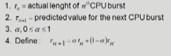

#### 5장 cpu schedualling

cpu burst > I/O burst > cpu burst > I/O burst 반복

- 프로그램의 종류에 따라서 각 기간의 빈도가 다름

- 여러 종류의 작업이 섞여 있기 때문에 cpu 스케줄링이 필요하다

- CPU bound job : cpu를 오래 사용 ,,,, I/O bound job : IO를 오래 사용

- i?o job은 interactive(사용자와 밀접)한 job이므로 적절한 반응 제공 요망

- cpu와 i/o 장치 등 시스템 자원을 골고루 효율적으로 사용

#### 프로세스의 특성 분류

- I/O bound job : I/O에 많은 시간이 필요한 job

- CPU bound job : cpu를 많이 사용하는 계산위주의 job

#### CPU 스케줄러, 디스패쳐

- cpu scheduler
  
  - ready 상태의 프로세스 중에서 이번에 cpu를 줄 프로세스를 고른다

- dispatcher
  
  - cpu의 제어권을 스케줄러에 의해 선택된 프로세스에게 넘긴다
  
  - 이 과정을 문맥교환이라고 한다

- cpu 스케줄링이 필요한 경우는 프로세스에게 다음과 같은 상태 변화가 있는 경우
  
  - runnning > blocked (ex)I/O 요청하는 시스템 콜)
  
  - running > ready (ex)할당시간만료로 timer interrupt)
  
  - blocked > ready (ex)I/O 완료 후 인터럽트)
  
  - Terminate : (종료)

cf) 1, 4 스케줄링은 nonpreemptive : 강제가 아닌 자진반납

다른 스케줄링은 preemptive : 강제로 뺏긴 것

### cpu 스케줄링 성능척도

시스템 입장

- cpu utillzation 이용률 : 전체 시간 중 cpu가 작동한 시간

- throughput 처리량 : 주어진 시간 동안 몇개의 작업을 처리했는가

프로세스 입장

- turnaround time 소요시간, 반환시간 : cpu를 쓰러 와서 다 쓰고 나갈 때까지 걸린 시간

- waiting time 대기시간 : cpu를 쓰려고 대기한 시간 ( 줄서는 시간이 여러 차례 발생)

- response time 응답시간 : ready 상태에 들어와서 최초로 cpu를 얻기까지 걸린 시간

    

    

### FCFS (선입선출)

- p1:24, p2:3, p3:3
  
  대기시간 : 0+24+27 / 평균대기시간 17

- p3:3, P2:3, P1:24

        대기시간 : 0+3+6 / 평균대기시간 3

- 먼저 대기한 프로세스가 무엇이냐에 따라 효율성이 달라짐

- convoy effect : 짧은 프로세스가 긴 프로세스보다 늦게 와서 오래 대기하는 것

### SJF (사용시간이 제일 짧은 순)

- 각 프로세스의 다음번 cpu burst time을 가지고 스케줄링에 활용

- 가장 짧은 프로세스를 제일 먼저 스케줄

- Two schemes:
  
  - nonpreemptive : 일단 cpu를 잡으면 이번 cpu burst가 완료될 떄까지 cpu를 선점당하지 않음
  
  - preemptive : 현재 수행중인 프로세스의 남은 burst time보다 더 짧은 cpu burst time을 가진 새로운 프로세스가 도착하면 cpu를 빼앗김
  
  - 이 방법을 SRTF라고도 부른다

- p1:0.0:7, p2:2.0:4, p3:4.0:1, p4:5.0:4   (non)      =  process : arrival time : burst time
  
  대기시간  0+6+3+7 , 평균대기시간 = 4

- p1:0.0:7, p2:2.0:4, p3:4.0:1, p4:5.0:4 (pree)
  
  대기시간 9+1+0+2 , 평균대기시간 = 3

- 문제점
  
  - starvation(기아현상) : 짧은 프로세스를 계속 투입하기 때문에 cpu 사용 시간이 긴 프로세스는 영원히 작업 불가능 
  
  - 소요시간이 짧은 프로세스에게 cpu를 할당한다고 했는데 이를 정확히 측정하고 예측할 수 없음

               -> 과거에 cpu를 사용한 흔적을 통해서 어느정도 추정

- 해결책 : aging(노화 ) : 시간이 오래 걸리는 프로세스여도 대기 시간이 길어지면 우선순위를 높여줌

#### 추정

- 다음번 CPU burst time을 추정하는 법 : 과거의 cpu 사용시간을 통해 

- 

#### priority scheduling

- 우선순위가 가장 높은 프로세스에게 CPU를 준다 (제일 작은 정수로 표현)

- preemptive : 더 높은 우선순위를 가진 프로세스가 오면 빼앗김

- nonpreemptive : 더 높은 우선순위를 가진 프로세스가 오면 빼앗기지 않음

cf)SJF도 우선순위 스케줄링이다 (짧은 cpu 사용시간을 우선순위로 둔다)

     

    

### Rrund Robin

- 각 프로세스는 동일한 크기의 할당 시간(time quantum)을 가짐

- 할당시간이 지나면 프로세스는 신짐당하고 ready queue에 돌아와 다시 대기한다

- n개의 프로세스가 ready상태이고 할당 시간이 q time unit인 경우 각 프로세스는 최대 qtime unit 단위로 cpu 시간의 1/n을 얻는다 >어떤 프로세스도 (n-1)q time unit 이상 기다리지 않는다.

- q large > FCFS이나 다를 거 없다 / q small > 문맥교환이 너무 빈번히 발생

- 일반적으로 SJF 보다  반환시간은 길지만 응답시간은 짧다

- cpu 사용시간이 어느정도 걸리는지 알 수 없는 프로세스들이 뒤죽박죽일 때 효과가 좋음

        

        

#### multi lv Queue

- system process > interactive > interactive editing > batch > student

- ready queue를 여러 개로 분할
  
  - foreground(interactive)
  
  - background(batch)

- 각 큐는 독립적인 스케줄링 알고리즘을 가짐
  
  - foreground : RR
  
  - background : FCFS

- 큐에 대한 스케줄링이 필요
  
  - fixed priority : foreground가 우선, 이러면 기아현상 발생
  
  - time slice : 각 큐에 적절한 비율로 cpu time을 할당

#### multi lv feedback q

- 계층이 나눠져있지만 계층 간 이동 가능

- 프로세스가 다른 큐로 이동 가능

- 에이징을 이와 같은 방법으로 구현 가능

- 파라미터들
  
  - queue의 수
  
  - 각 큐의 scheduling algorithm
  
  - process를 상위 큐로 보내는 기준
  
  - process를 하위 큐로 보내는 기준
  
  - 프로세스가 cpu 서비스를 받으려 할 때 들어갈 큐를 결정하는 기준

    

    

#### multi processor scheduling

- cpu가 여러 개인 경우 스케줄링은 더 복잡해짐

- homogeneous processor인 경우
  
  - q에 한 줄로 세워서 각 프로세서가 알아서 꺼내가게 할 수 있다
  
  - 반드시 특정 프로세서에서 수행되어야 하는 프로세스가 있는 경우에는 문제가 더 복잡해짐

- Load sharing
  
  - 일부 프로세서에 job이 몰리지 않도록 부하를 적절히 공유하는 메커니즘 필요
  
  - 별개의 큐를 두는 방법 vs 공동 큐를 사용하는 방법

- symmetric multiprocessing (smp)
  
  - 각 프로세서가 각자 알아서 스케줄링 결정

- asymmetric multiprocessing
  
  - 하나의 프로세서가 시스템 데이터의 접근과 공유를 책임지고 나머지 프로세서는 거기에 따름

    

    

    

#### real time scheduling

- hard real time systems
  
  - 정해진 시간 안에 반드시 끝내도록 스케줄링 해야 함

- soft real time computing
  
  - 일반 프로세스에 비해 높은 우선순위를 갖도록 해야함

    

    

#### 스레드 스케줄링

- local
  
  - user level 스레드의 경우 사요자 수준의 스레드 library에 의해 어떤 스레드를 스케줄할지 결정

- global
  
  - 커널 레벨 스레드의 경우 일반 프로세스와 마찬가지로 커널의 단기 스케줄러가 어떤 스레드를 스케줄할지 결정

    

    

    

#### Algorithm Evaluation

- queueing models
  
  - 확률 분포로 주어지는 arrival rate와 service rate 등을 통해 각종 퍼포먼스 인덱스 값을 계산

- 구현&성능 측정
  
  - 실제 시스템에 알고리즘을 구현하여 실제 작업에 대해서 성능을 측정 비교

- 시뮬레이션
  
  - 알고리즘을 모의 프로그램으로 작성 후 trace를 입력으로 하여 결과 비교
