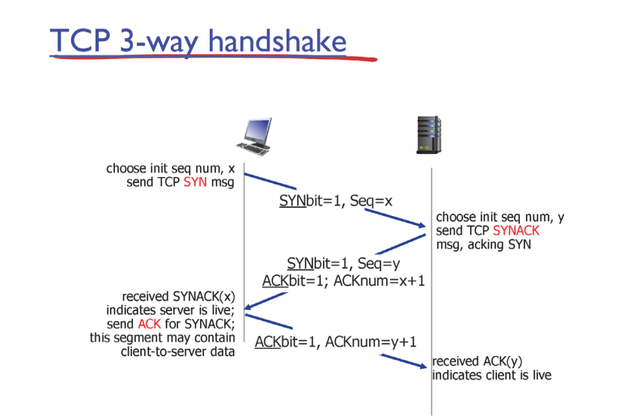
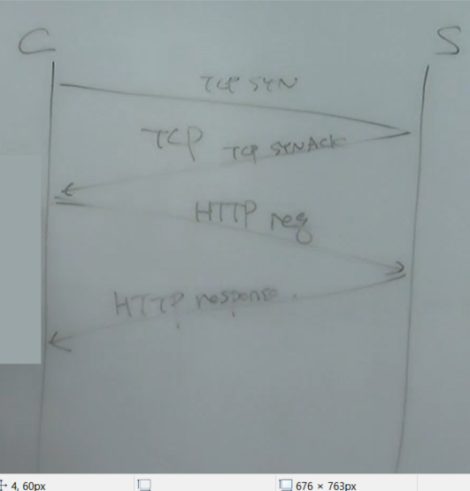
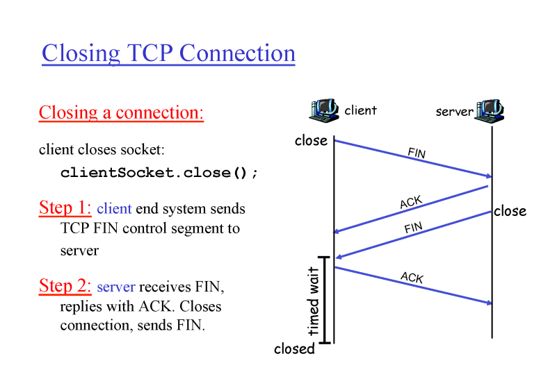

### flow control

-  ( 아주 중요한 기능이지만 단순하다)

tcpa : send buf (window 크기 만큼 보낼 수 있다)  /   rec buf

tcpb : send buf  /   rec buf ( available space 이 적다)

이 때 available space에 맞게 조절해준다

- 양이냐 속도냐 ? 같이 가는 느낌 많이 보내면 빠른거고/ 적게 보내면 느린거다 ( 1초에 몇 비트를 보내냐)

- 데이터를 읽는 것과도 연관이 있다. 읽는 곳에서 처리해야 빈 공간 생김 > 0을 응답한 이후에 빈 공간이 생겨도 응답을 안 할 수 있다.

- send에서 아무 의미 없는 데이터를 보내서 응답을 요구한다

- rec 가 응답할 수 있도록

    

### connection management

### three way handshake

1) client sends TCP SYN segment
   
   - specifies initial seq#
   
   - no data

2) server recieves SYN, replies with SYNACK segment
   
   1) allocates buffers
   
   2) specifies server initial seq#

3) client receives SYNACK
   
   replies with ACK segment, with data

- 세번 오고 가야지 클라이언트와 서버 모두 전송이 온전하게 오고 갔다는 걸 알고 있음

### closing TCP connection

바로 종료하지 않고 timed wait가 있는 이유 : ack가 유실, server가 계속 기다릴 수 있기 때문에

    

- sending data는 reciver의 용량과, 중간 s네트워크의 용량에 맞춰야 한다

- net ,  recv : 둘 중 작은 놈에게 맞춰야 한다 (5,10 : 5)(11,6:6)

##### 네트워크는 공용

센더는 데이터를 빠르고 많이 보내기를 원한다

네트워크는 한계가 와서 막힌다

막히면 데이터를 조절해야 한다

근데 TCP는 계속 재전송한다

tcp는 네트워크가 막히면 계속 재전송해서 악화되는 구조

네트워크가 막히지 않도록 조절해줘야 한다

->그러면 네트워크가 막히지 않도록 조절은 어떻게 해야하나

### end-end congestion control

- 양 끝에서 데이터 양을 알아서 유추해서 조절

- sender와 receiver

- 오고 가는 ack를 가지고 유추해라(정확하지 않고 엇비슷)

### network-assisted congestion control

- 네트워크에서 직접 피드백을 주고 조절하는 방식

- 현실적으로 불가능

