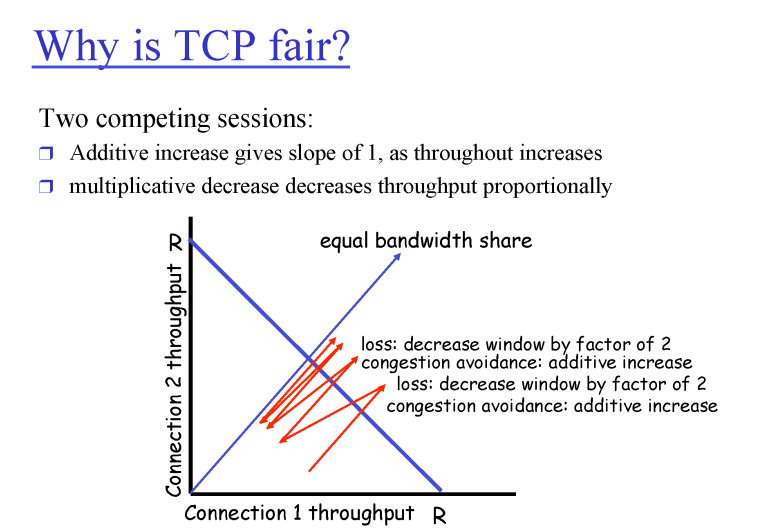

가장 얇은 파이프에 맞춰서 보내야 한다 > 이 부분을 찾을 방법?

### TCP congesstion control

#### 3 main phase

- MSS(maximum segment size):500byte

##### 1) slow start

- 점진적으로 2배씩 증가하면서 보냄

- 0에서 시작해서 빠르게 증가

##### 2) additive increase

- 증가하다가 어느 지점(thresh-id)에서 증가하는 속도를 느리게 감소

##### 3) multiplicative decesase

- paket loss를 탐지, 현재 양의 절반으로 감소시킴

- 2와 3의 반복

- 데이터 전송 속도는 congwin/rtt(갔다가 오는 시간)

- 데이터 전송 속도는 네트워크가 우리의 전송속도를 결정

- 네트워크의 상태는 우리가 보내는 데이터가 결정

- 초기 Tahoe의 방식 : 1에서부터 빠르게 증가 > threshold > 하나씩 증가 > 패킷 유실 > 처음으로 떨구기 >  threshold를 패킷 유실이 탐지된 윈도우 사이즈의 절반으로 설정하고 초기 과정 반복

- 2 Reno 방식 : 

timeout : 모든 패킷들이 안 가고 있는 것이므로 네트워크 상태 안 좋음

3 dup ack : 다 잘 가고 있는데 하나의 패킷만 유실이므로 네트워크 좋음

3dpu 유실인 경우에는 threshold에서부터 증가

    

### tcp fair

- 사용자가 2이 있을 때 1/2씩 전송량을 사용하는가 

- 결과적으론 fair하다

- 1이 더 많이 차지하고 있다가도 서로 증가하다가 loss가 생기면 절반으로 감소, 이 과정을 반복하다보면 결국 R/2 만큼 씩 사용

