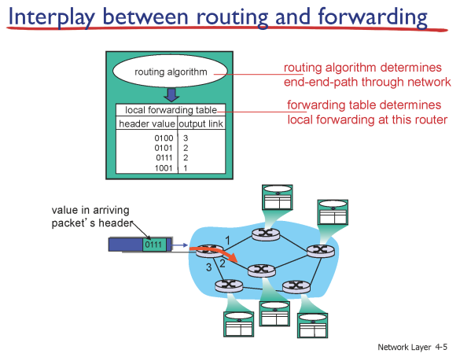
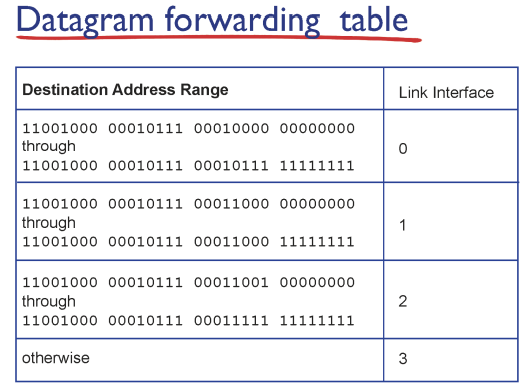
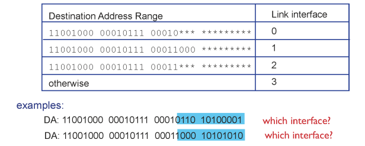

app

tranceport

network

link

phy

### 라우터

- 포딩 : 들어온 패킷의 목적지 주소와 포딩 테이블의 엔트리를 매칭 시켜서 알맞은 곳으로 보낸다

라우터 안에 있는 포딩테이블가 특정 데이터가 가려면 어떤 인터페이스로 내보내라 적혀있다

- 포딩 테이블은 범위로 적혀있다 : 1~10 까지는 1번으로 나가라

- 라우팅
  
  - 포딩 테이블을 만드는 것은 복잡하다 > 라우팅 알고리즘

첫번째 0번

두번째 1번 > 더 구체적으로 맞는 곳으로 이동

가장 길게 맞는 곳에 보낸다 > 롱기스트 매칭

