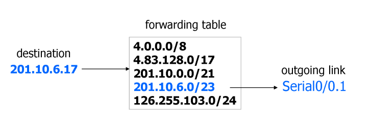
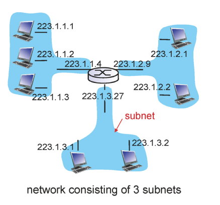
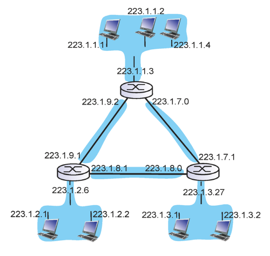
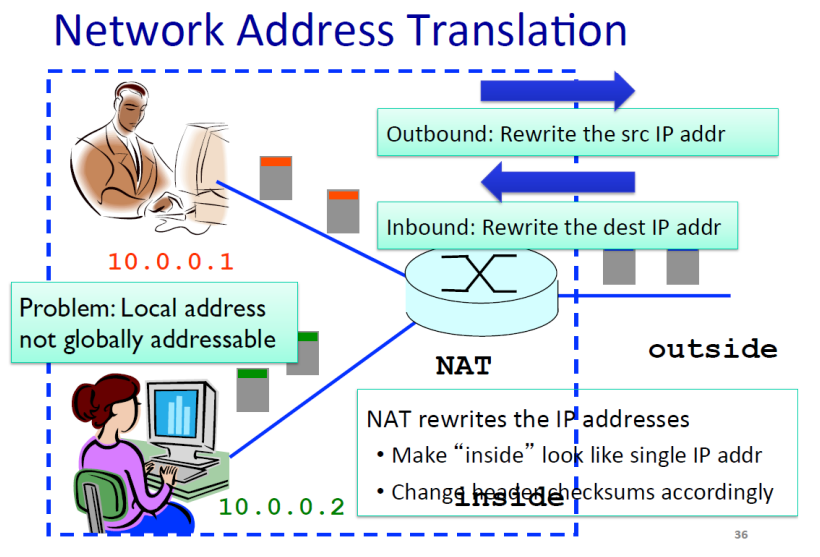
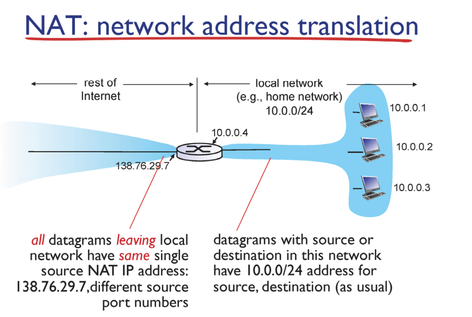

#### ip data format

- ip header
  
  - source ip address
  
  - destination ip address
  
  - time to live : ttl에 20이 적혀있으면 라우터를 거칠때마다 1씩 마이너스 > 0이 되면 해당 패킷은 버려진다 > 한정된시간 동안만 네트워크에 존재하다가 사라져라
  
  - upper layer : 전송계층에 tcp인지 udp인지 확인

- ip hearder : 20byte

- tcp hearder : 20byte  > 40byte + app layer overhead

### ip  address

- 32비트 숫자 > 사람이 읽기 쉽게 8비트씩 10진수로 끊어 읽음

- 호스트에 들어있는 네트워크 인터페이스 지칭

- ip 주소를 여러개 가지는 컴퓨터 > 라우터

- 배정 방법
  
  - 랜덤으로 배정하면 포딩 테이블이 너무 복잡해짐
  
  - 계층화 : 앞부분은 네트워크 id, 뒤는 호스트 id
  
  - 같은 네트워크는 같은 앞부분을 가진다
  
  - 호스트를 추가할 때 뒷부분만 변경하면 된다
  
  - 포딩 테이블이 단순해짐

    

### classful addressing

- ip 주소를 클래스로 나눴다

- a클래스 : /8 : 8개 기관, 2** 24 개의 호스트 주소

- b클래스 : /16 : 2**16

- c클래스 : /24 : 24 기관 , 2**8
  
  - 편차가 너므 크다 > 한 기관에 여려 개 가져야 함

    

### classless

- prefix > 자유롭게 끊어진다

- /22 > 1024개

    

### 라우터 안의 포딩 테이블

  

- 패킷 들어와서 포딩테이블에 적힌 엔트리로 간다

- 3과 4 일치하지만 가장 길게 일치한 4로 간다

-  포딩 테이블을 채우는 것 > 라우팅 알고리즘

    

### ip addressing CIDR

- subnet : 같은 perfix를 가진 디바이스의 집합

- 라우터를 거치지 않고 접근 가능한 호스트들의 집합

- 서브넷은 같은 prefix를 가진 집합

- 6개 서브넷

    

IPv4

32bit

2**32 hosts

40억

1996년

IPv6

128bit

2**128 hosts

2013

IPv4

40억개의 주소공간을 공유하고 있다

### network address translation

- 네트워크 주소공간 부족을 회피하기 위한 방법

- 내부적으로만 존재하는 네트워크 존재 > 라우터를 거치면서 하나의 네트워크로 변경해서 외부로 나간다

- 포트번호를 가지고 내부에서 찾는다

- ip주소를 재사용하는 방법

- 라우터가 멋대로 헤더정보와 데이터를 수정했다는 문제점

- 포트 넘버로 호스트를 찾는 데 써버려서 이제 포트는 어떻게 찾을 것인가 > 내부에서는 서버를 운영할 수 없다 포트를 찾을 수 없어서
