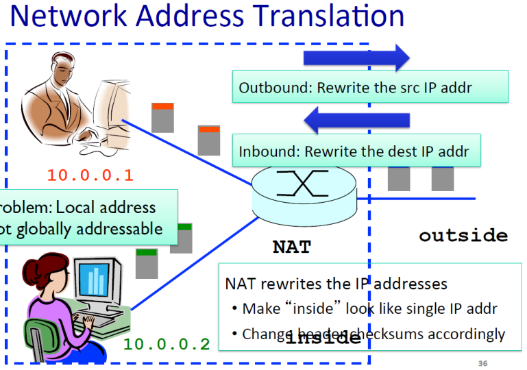

### network address translation

- 하나의 ip 주소를 내부에서 자체적으로 분할해서 사용자들끼리 사용

- 외부로 나가면 기능을 못함 > 게이트웨이 라우터에서 변환해줌

- NAT에서 구글에 쏘고 다시 받는 역할

- NAT에서 다시 변환해서 호스트들에게 전달

- 패킷을 ip번호로 찾지 못 하고 포트번호를 통해서 개별 호스트들에게 보내줌

- 호스트에게 갔을 때 포트번호로 포트를 찾아갈 수 없음

- 라우터가 단순히 포딩하는 것이 아니라

- 소스와 데이터를 고치는 일까지 함 > 역할군 붕괴

### IPv4의 문제점

- address space 부족

- security 위험

-> 고쳐야 한다 ip6로

    

### 인터넷을 하려면 필수적인 정보

- ip : 192.168.1.47

- subnet : 255.255.255.0

- router : 192.168.1.1

- DNS : 192.168.1.1  

-> 이 정보들을 정해준 것이 DHCP

    

### dynamic host configuration protocol

- 인터넷 하려면 필요한 정보들을 할당

- 다른 장소로 가면 다시 정보들을 할당해 줌

-cf) 고정된 ip나 주소를 설정할 수 있다

- discover : 도와달라고 메세지 (모두에게(호스트들, 서버))
  
  - 호스트들은 무시, 서버만 응답 : 포트번호로 확인 67

- dhcp offer : 제공, 포트번호 68, 1시간 동안 223.1.2.4 사용
  
  - dhcp 서버가 여러 개고 오퍼가 여러 개일 수 도 있다

- request : 사용할 거 라고 응답 : -> yiaddrr이 src 로 변경

- ACK : 확인 

    

게이트웨이 라우터 기능

네임서버, DHCP 서버, 포딩, NATs, firewall

    

### ip fragmentation

- 링크 별로 MTU가 다르다

- data가 특정 링크에서 MTU보다 크다면

- MTU 사이즈에 맞게 분할

    

- 4000b > headet 20/ data 3880

- 패킷 쪼개기 > 나중에 합칠 거 생각하며 쪼개기

- id는 동일, fragflag = 1 > 내 뒤에 조각이 있다는 것, offset=0

- id 동일, fragflag = 1, offset = 185 (1480/8)

- id 동일, fragflag = 0, offset = 370 (2960/8 )

- 중간에 한 개 유실되면 ? > reassembly가 안 되므로 타이머 터지고 재전송 

