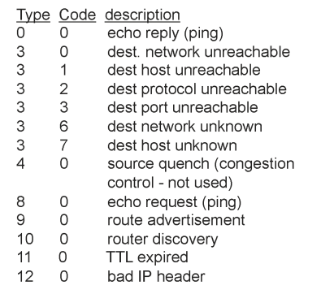
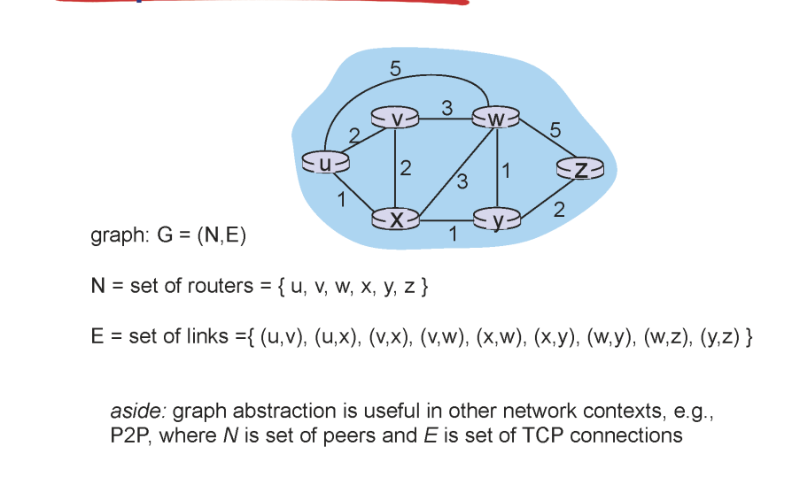
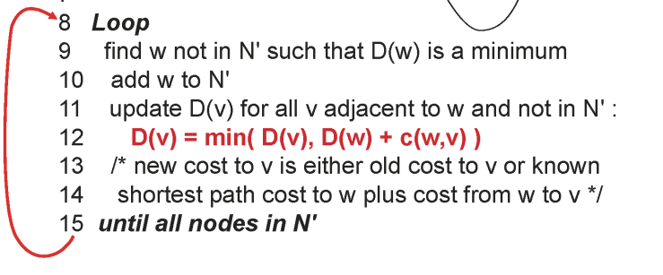
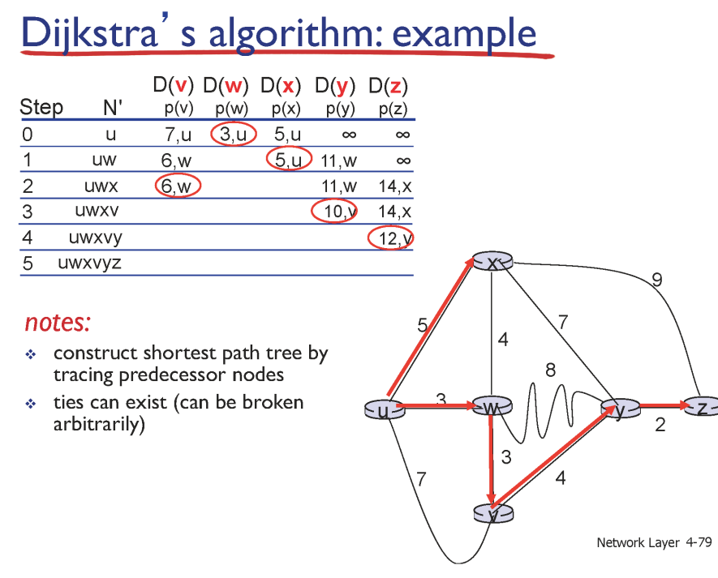
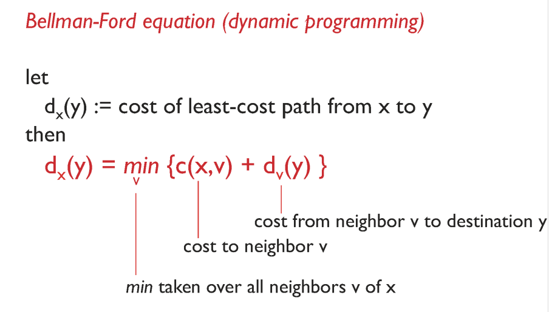

패킷

hdh / data

          tcp segment

    

### ICMP

- 사용자 정보가 아닌 네트워크에 떠돌아다니는 데이터를 운반

- 네트워크에서 패킷을 운반하다가 TTL이 0이 되어서 드랍 > 드랍했다는 것을 알려줘야 함 > 드랍했다는 패킷을 만들어서 전달(data에 드랍했다는 내용)

    

### IPv6

- IPv4에서 이동하려면 과도기가 존재할 것

- 어쩔 수 없다

- 해석을 해 줄 필요가 있다 

    

### 라우팅 알고리즘

네트워크는 그래프 / 최상의 경로를 구하는 문제

    

### 1. link state

- 자기 도메인 안에 있는 라우터들만 고려

-  모든 라우터를 고려해서 계산

- 모든 노드가 자신의 링크 정보를 전역 네트워크에 뿌려놓고 시작

- 모든 노드의 경로를 알고 있다

- 다익스트라로 최단 경로 구하기

- 최소 경로를 정하지 않은 노드 중 최소 경로 선정

- 인접한 행렬들은 원래 경로랑 선택 노드를 거치는 경로 비교

- 더 짧은 경로를 할당

- 반복

    

### 2. destination vector

- 이웃과만 정보를 구해서 최단 경로 구하기

- 자신의 이웃과만 안다

- 벨만 포드 (DP)

- x -> y 까지 가는 경로

- x의 이웃으로 가는 최소 경로 + 이웃에서 y까지의 최소경로

- 이웃에서 y까지 최소경로 = 이웃-이웃2 경로 +이웃2-y 경로

- 반복

