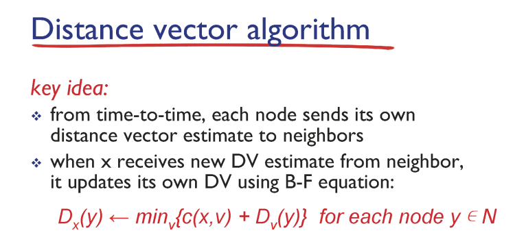
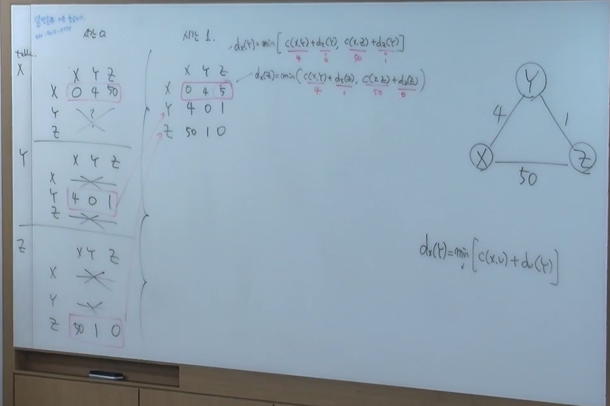
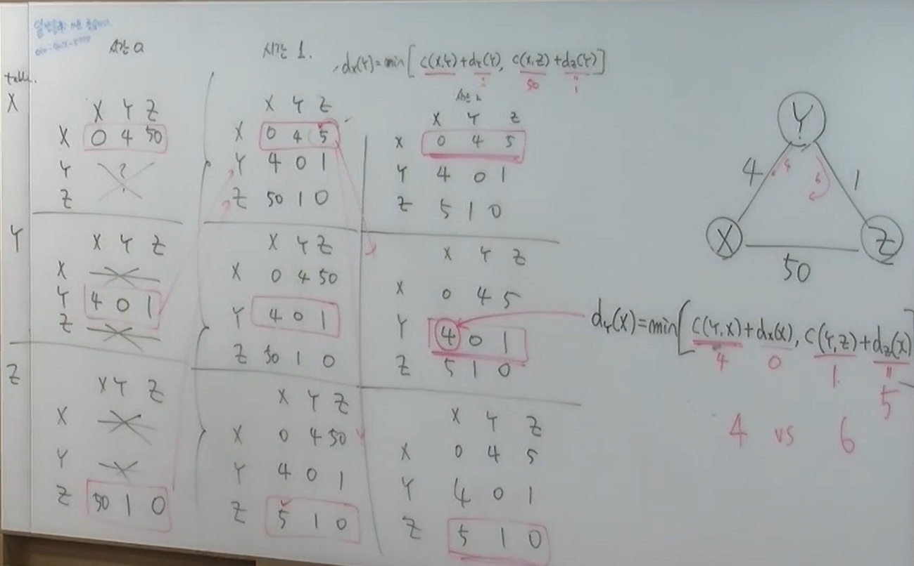
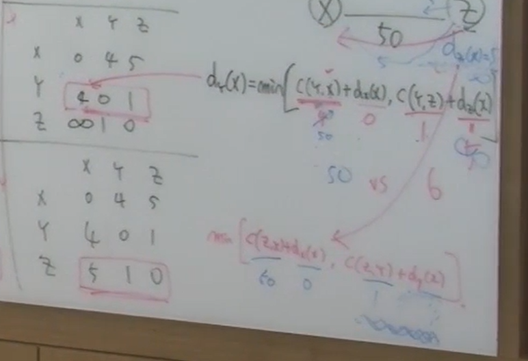
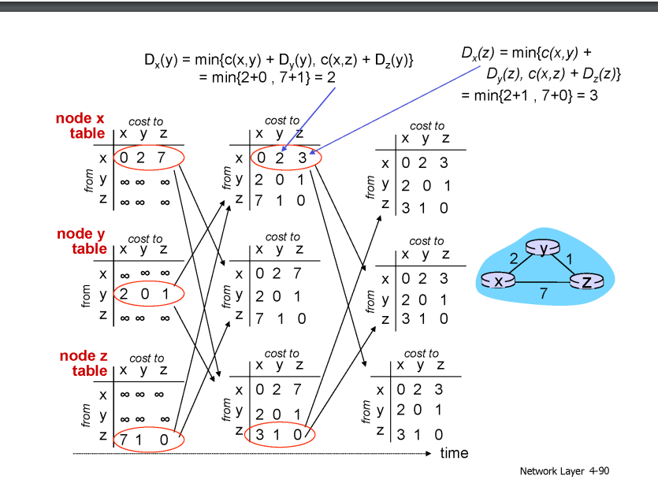

### distance vector algorithm

- x에서 y까지의 거리

- min(x--인접 노드까지의 거리 + 인접노드에서 y까지의 거리

- 각 노드가 자신에서 이웃 노드까지의 거리를 하나의 벡터로 x에게 알려주기 때문에 디스턴스 벡터 알고리즘

각 노드는 디스턴스 벡터를 자기와 인접한 이웃한테 알려줌

그걸 가지고 계산 > 디스탠스 벡터 업데이트 > 다시 연결된 이웃들한테 전달 > 다시 계산 > 업데이트 > 전달 > 반복

- 업데이트 되지 않으면 대기

x-y 가 50으로 바뀌면 > 그럼 4에서 50으로 바뀌는 게 아니라

미니멈 값을 계산해서 6으로 바뀐다 (사실은 6이 아니라 50+1인 길)

7>8>9>10 계속 바뀐다

- count to infinity

y를 통해서 가는 길은 y에게 알려주면 안된다

방지하기 위해서

- 자기 자신을 거쳐가는 길은 무한대

