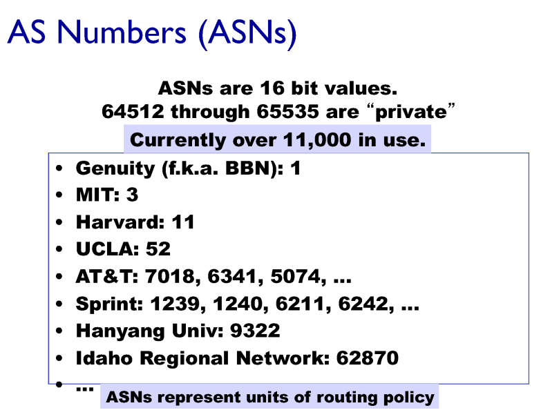
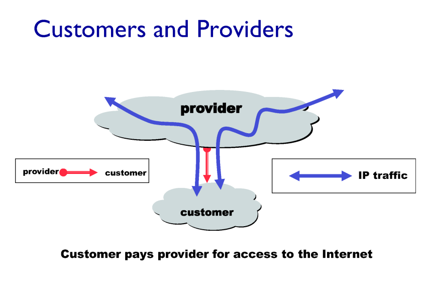
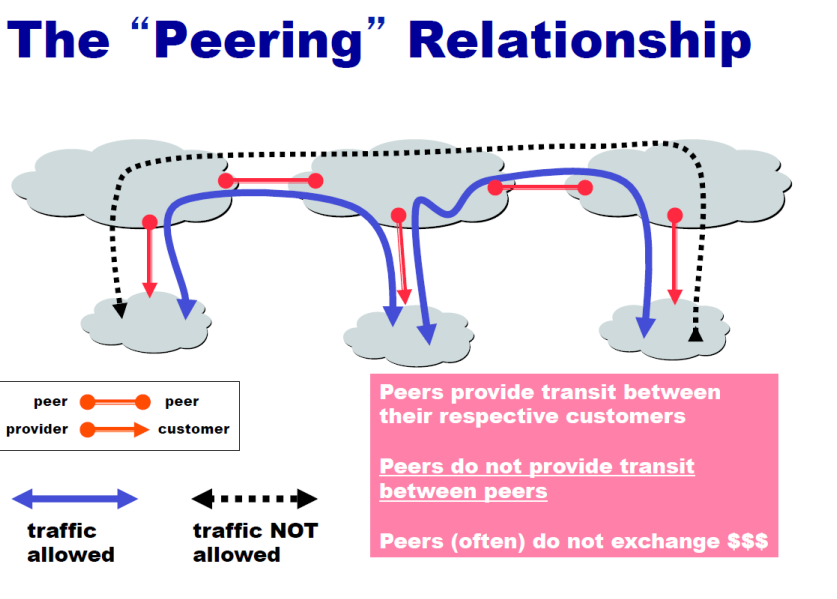
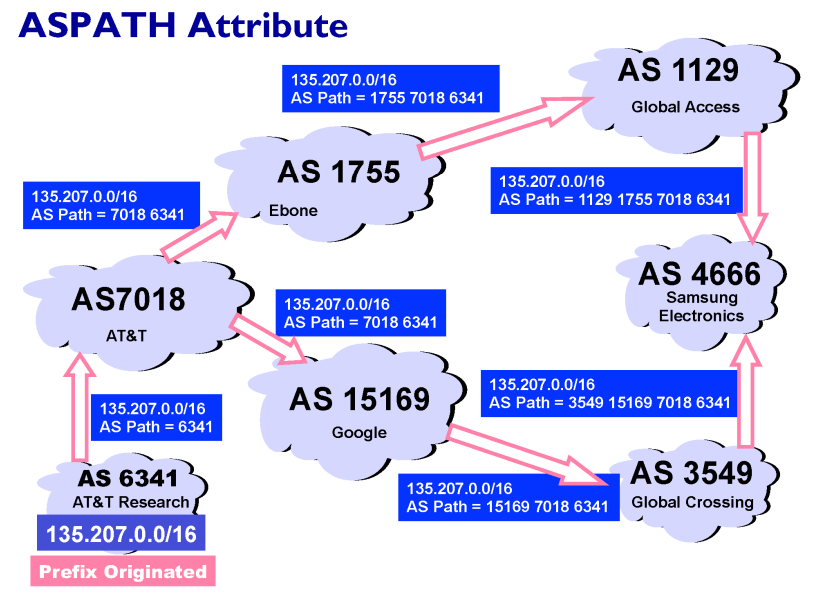
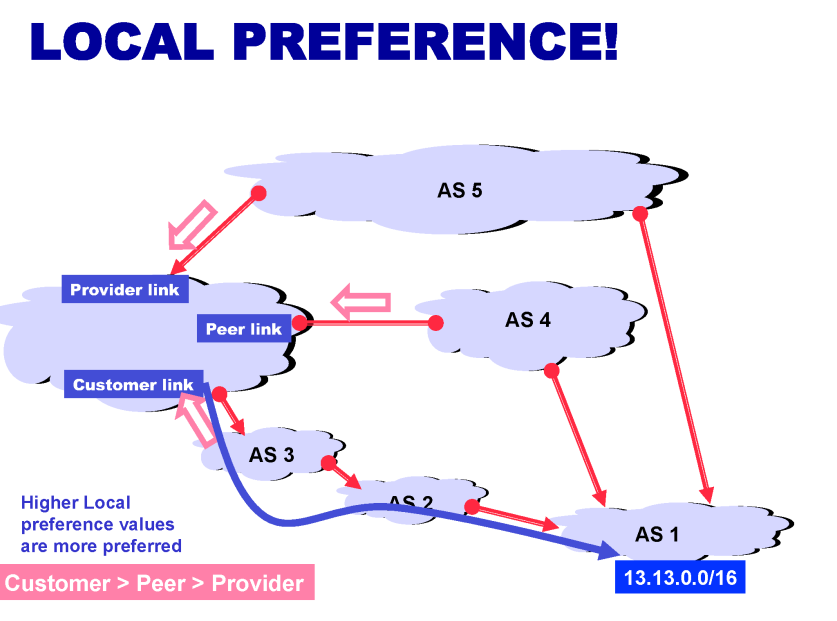

### count to infinity

- distance vector에서 a를 거쳐가는 경로를 b에서 c로 가는 최소 경로라고 a에게 알려주는 경고 잘못된 정보를 준 것

- poison reverse : a를 거쳐가는 경로를 a에게 알려주는 경우는 무한대라고 전달하는 방식

    

어머어마하게 큰 인터넷

- 링크 스태이트 돌리기 불가능

- 계층 별로 돌린다 > 내부에서 최적의 동선 > 네트워크 간의 연결은 따로 계산

- AS : 한 기관에서 관리하는 네트워크 라우터들의 집합 
  
  - 동일한 prefix를 가지는 라우터들의 집합
  
  - 고유한 넘버 부여

### Interconnected ASes

- 전체 네트워크를 연결하는 규칙

- 단거리를 우선

- 최단 경로가 우선

### 네트워크 간 관계

- as 들 간에도 차이가 있다(위상)

- customers and providers 관계
  
  - 상위 AS에게 사용금을 지불하고 트래픽을 받음

- peer 관계
  
  - 서로 트래픽 자유롭게 허용

    

### BGP 4( border gateway protocol)

- AS들 간의 정책에 따라서 결정

- 자신의 프리픽스를 다른 as들에게 알리는 것

- 전달받은 as path에 자신의 asnumber를 포함해서 전달시킴

- 자기가 원하는 as number을 선택할 수 있다

- 돈이 되는 즉, customer > peer > provider

