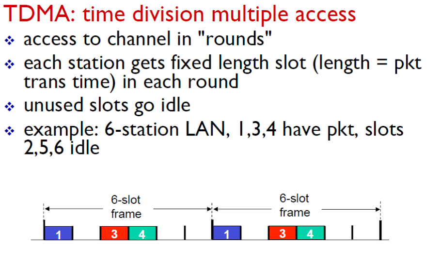
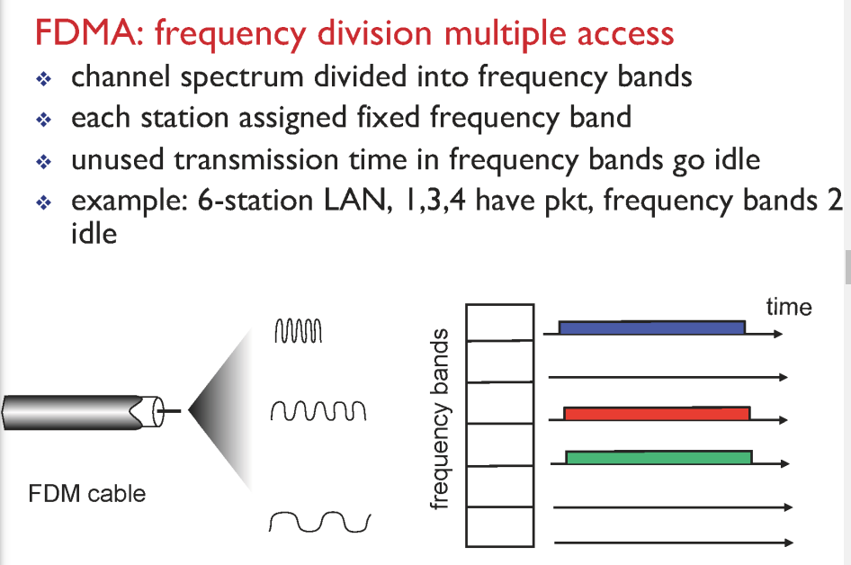
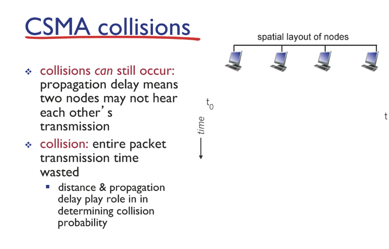
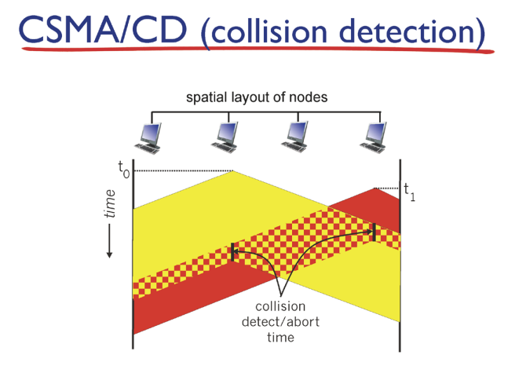
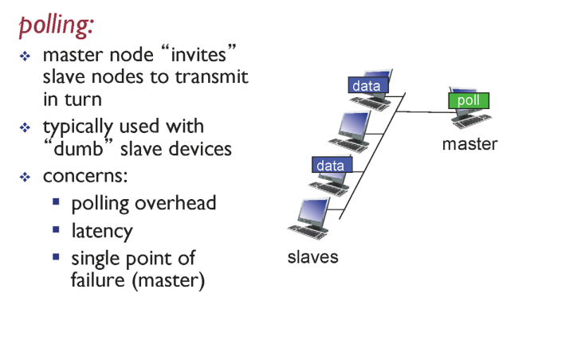
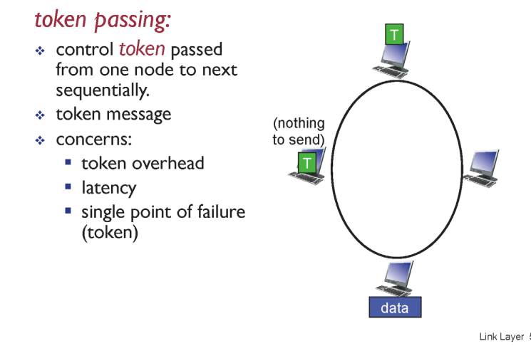
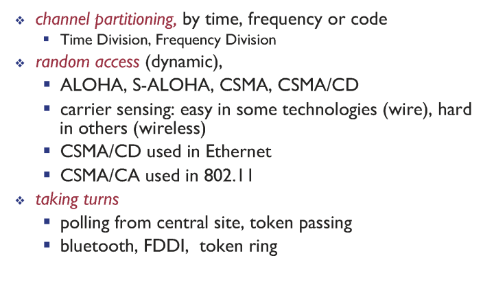

### Link layer

    

app

transport

network

link

phy

    

패킷 > 게이트웨이 라우터한테 보냄

실제론 패킷 > 링크 > 게이트웨이 라우터

    

한 홉을 어떻게 가느냐

유선 이더넷, 와이파이, 등등 결과는 같지만 과정에서 조금의 차이

    

### 링크 래이어 위치

- 네트워크 인터페이스 카드 > 링크 래이어

        

### multiple access links, protocols

- point to point

- broadcast(shared wire ir medium)
  
  - medium acess control
  
  - MAC protocol : 적절히 겹치지 않게 사용하도록 조절

    

### 이상적 맥 프로토콜

- 한 노드가 데이터를 전송하고 싶을 때 r밴드위스 전체를 온전히 사용

- 여러 노드가 데이터를 보내고 싶으면 장기적으로 n등분해서 밴드위스를 사용

- 중앙 컨트롤러가 있는 게 아니라 분산 처리 형태

- 단순한 구조

    

### mac protocol 방식

### channel partitioning

- time division multiple access

- 시간을 쪼개서 여러 사람들이 사용할 수 있게 한다

- 지정된 시간, 차례에만 사용하도록 한다

- 사용자가 많으면 효율적

- 사용자가 적으면 아무도 안 쓰는 시간에는 낭비

- frequency divison

- 각자 자기 자신의 데이터를 보낼 수 있는 주파수 지정

    

### random access

- 보내고자 하는 데이터가 있을 때 보낸다

- 충돌 발생 가능성 > 이를 감지하고 해결하는 것이 핵심

- aloha : 최초의 random

- carrier sense multiple access

- 누군가 이야기 하고있으면 자기가 할 얘기를 머릿속에 저장, 정리
  
  - 이야기가 끝나면 자기가 이야기 > 충돌이 일어나지 않는다

- 이야기가 끝났을 때 둘이 동시에 자기 이야기를 시작 > 충돌 발생

- csma/cd ( collision detection)

- 둘이 동시에 보내고자 하는 데이터가 있어서 전송
  
  - 완전 동시가 아니더라도 자기한테 데이터가 오지 않았기 때문에 전송 가능(딜레이 때문에)

- 서로 충돌 > 충돌이 발생하면 멈춘다(binary(exponential) backoff)
  
  - 충돌이 발생하면 n번 충돌하면 (0,n) 중 랜덤하게 골라서 대기
  
  - 충돌이 5번 발생하면 (0,1,2,3,4) 중 랜덤하게 골라서 대기
  
  - 충돌이 여러번 발생하면 오래 기다리게 한 이유 > 충돌이 여러번 발생하면 다른 전송이 여러 개 일 수도 있다고 예측해서

- 사람들이 많을 때 지연된다, 

- random access 방식의 장점이자 단점
  
  - 내가 원할 때 전송할 수  있으니 장점
  
  - 여럿이 동시에 전송했을 때 backoff로 인해 지연시간이 엄청 길게 느껴진다

- 사용자가 많으면 효율성 떨어짐

- 사용자가 적으면 좋음

    

### taking turns

- polling

- master 가 각각의 컴퓨터의 전송들 통제

- 마스터에 문제가 발생하면 전부 멈추는 치명적인 문제

    

- token passing

- 토큰을 가지고 있는 사람만 데이터 전송

- 전송할 데이터가 없으면 토큰 넘긴다

- 문제점 : 토큰이 유실되면 정지

    

    

랜덤 액세스 방식을 주로 사용

