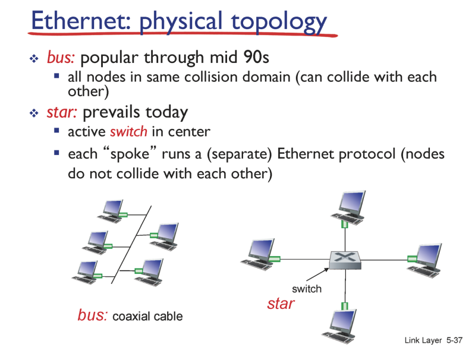
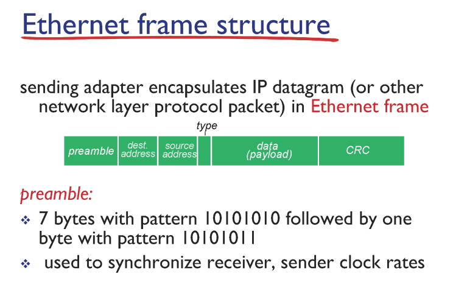
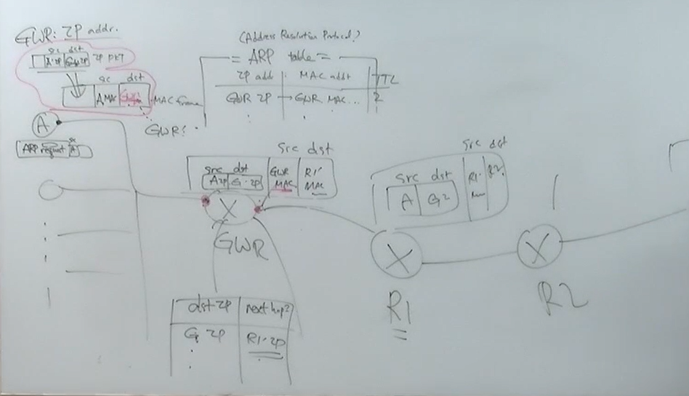

### LANS

- local area network

- subnets : 같은 prefix를 가져서 라우터를 거치지 않고도 통신 가능

- lans으로 연결

    

### Ethernet

- type : 무슨 프로토콜인지 ip 프로토콜

- preamble : prefix

- dest address

- source address

    

### csma/cd

- carrier sense

- collision detection

- random access

데이터 전송하는 지점이 없으면 전송 대기하던 녀석들이 전송 시작, 겹치면 backoff(n번 겹치면 0~n-1 구간 중 랜덤하게 backoff)

- 유선 상황에서는 데이터 전송 시 

- 컬리전이 발생해서 라우터 도달 못하는 경우 아니면 다 라우터에 도착

- 컬리젼 발견하면 재전송 (컬리전 탐색이 중요하다)

- a가 데이터 보냄    

- 데이터가 e에 도착하기 직전에 커리젼 디텍트

- e는 중단

- e가 보낸 메세지가 a에 도달하기 전에 a가 메세지를 다 보내면

- 메세지가 커리젼 없이 다 도착했겠구나 판단

- 실제로는 커리젼이 있었는데 탐색 못 했다

- a가 조금만 더 길게 데이터를 보냈으면 탐색할 수 있었다

- 무의미한 데이터를 보내면서 64byte까지 패딩을 집어넣는다

    

### header > address

- mac address

- 48비트

- 앞의 24비트는 제조회사, 뒤의 24비트는 고유넘버

- host name(이름), ip(주소) 는 바꿀 수 있다

- mac address 는 못 바꿈

    

- 각각 고유한 lans 주소를 가진다

ip 패킷 ( source : 나의 ip / destinations : 구글의 ip)

프레임 ( 프레임의 데이터로 들어옴 / source : 나의 mac add / des : 게이트웨이 라우터의 mac add)

프레임 (데이터/ source : 게이트웨이 mac add(위랑 다른 add 다른 방향이라서/ des: r1 라우터의 mac add)

# arp table

ip add - mac add - cash

host name에 arp table 이 있다 ( address rasolutions )

ip add와 mac add의 연결을 쭉 나열

없으면 채워넣는다(arp request라는 프레임을 랜 전체에 보낸다)

mac add 를 알아낸다

캐쉬 테이블에 저장 (저장 시간이 적혀있다, 2시간/ 2시간 동안 저장)

패킷 꺼내서 포딩 > 프레임 만들어서 source:r1 mac / des:r2 mac

    

mac 주소

- IP 주소는 네트워크 계층(Network Layer)에서 사용되는 주소다. 반면 MAC 주소는 데이터 링크 계층(Data Link Layer)에서 사용되는 주소로, LAN(Local Address Network)에서 목적지와 통신하기 위한 실질적인 주소이다

    

ARP

- ARP(주소 결정 프로토콜)는 네트워크 상에서 IP 주소를 물리적 네트워크 주소(MAC 주소)로 대응시키기 위해 사용되는 프로토콜이다. 

- 즉, ARP는 IP 주소와 MAC 주소를 일대일 매칭 시켜 LAN에서 목적지를 찾아갈 수 있도록 하는 프로토콜이다. 

- IP주소와 MAC 주소를 일대일 대응하여 정리한 테이블을 **ARP Table**이라고 한다.

- ARP query를 받은 호스트들은 ARP query에 들어있는 IP 주소와 자신의 IP를 비교하여 동일하다면 응답하게 된다. 

- 즉, B가 ARP Request에 자신의 MAC 주소를 담아 A로 유니캐스팅하게 된다. ARP request를 받은 A는 ARP Table에 B의 IP 주소와 MAC 주소를 대응시켜 저장해 놓는다. 

- 이후 A는 B에게 데이터를 전송할 때 ARP Table의 MAC 주소를 이용하게 된다.

