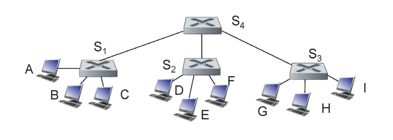
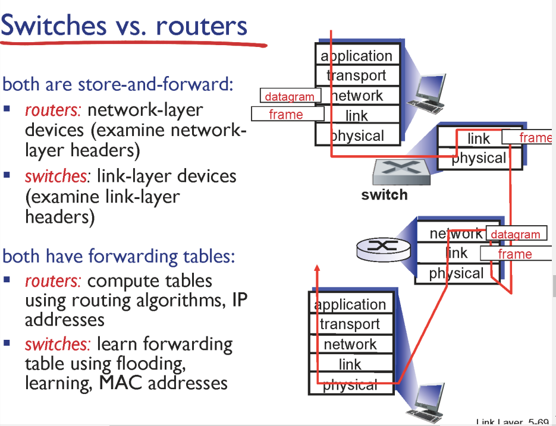

- a호스트에서 b호스트까지 패킷 보내기

- 프레임에 씌운다 (소스는 자신, 데스트는 b의 mac) : 포딩 테이블에서 ip 확인, 해당 ip로 arp에서 mac 확인 ( 테이블 룩업 2번)

- 게이트웨이에서 2번 반복

    

### switchs

- collision domein을 분리

- 호스트 눈에는 보이지 않음

- 동시에 보낼 수 있다

- 같은 곳에 보낼 때도 중간에서 교통 정리 해준다

    

### self-learning

- 각각의 포트가 어디에 있는 지 확인하기

- a가 1번 포트에서 오면 a가 1번 포트에 있다고 저장

- 목적지를 모르니까 1번을 제외한 모든 포트에 보낸다(flood)

- a'에서 4번 포트에서 오면 4번 포트에 있다고 저장

    

### multi-switch

- 규모가 커지면 스위치 아래 스위치 아래 포트들을 두는 구조

- 네트워크 레이어 관점에서 스위치는 없다고 여김

- a에서 i 까지 스위치를 여럿 거쳐야 하는데 어떤 구조인가

- a에서  출발 > 목적지를 모르니 플루드 > 스위치들이 셀프러닝

- 이런 과정 반복하며 포트를 알면 바로 전송 아니면 플루드

    

- 스위치와 공유기의 차이

- 공유기는 하나의 ip를 NAT로 분산해서 사용하게 해주는 것

- 하나의 서브넷

- 하나의 컴퓨터 느낌

- 인터넷들을 스위치는 단순히 연결해주는 것

    

### data center

- 스위치의 계층화

