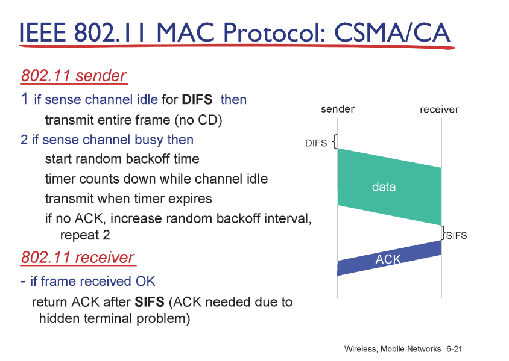

### wirelsee and mobile networks

- 무선 링크인 상황들이 도입

    

### wireless

- 무선

- 첫 홉만 무선이고 나머지는 유선이다

- 내 기기에서 중간까지만 무선으로 연결

인프라 스트럭쳐가 있으면서 싱글홉인 경우가 대다수

    

### 무선 링크

- 신호세기가 거리가 지날수록 줄어든다
  
  

- a에서 보낸 신호는 c에선 안 들린다(캐리어센스 불가능)

- a가 신호를 보내면 자기가 하는 말만 들리고  다른 곳에서 보낸 말은 잘 안들린다 : 자기 근처에서 신호가 가장 세므로

    

### IEEE 802.11  >  wifi(wireless fidelity)

- 점점 유선에 가까운 성능으로 발전

- 공유기 - 스위치-라우터-인터넷

- 공유기에서 내 기기까지만 무선

- 스캐닝 

- 패시브 : 주기적으로 비콘에서 기기에 자기 정보를 보냄

        

### 멀티플 엑세스

- 유선 이더넷에서는 충돌이 안 날때까지 신호를 보내기 때문에 ack가 없다

- 무선 이더넷에서는 충돌이 없기 때문에 신호를 보내면서 ack(tcp에서의 ack랑 다르다)가 필요하다 : 한 홉이 잘 갔는지 확인하는 ack

- csma/cd와 차이점

- 유선에서는 충돌이 일어나면 바로 멈춘다 : 피해가 크지 않으므로 충돌을 줄이려는 노력은 굳이 하지 않는다

- 무선에서는 충돌을 감지 못하므로 멈추지 않는다 : 무선에서 충돌의 피해가 더 크다 : 피해가 크므로 충돌을 줄이려는 노력 : csma/ca 에다가tes/cts 추가

- rts : 데이터를 보내기 전에 rts돌멩이를 먼저 보내보고 AP는 돌멩이를 성곡적으로 받으면 CTS를 응답 : 충돌이 없으면 데이터를 보낸다

- 충돌이 일어나도 조그마한 충돌이다

- rts는 주변 애들도 받는데 rts에는 나개 AP를 얼마나 사용할 건지에 대한 정보가 담겨있다

- cts : AP가 RTS를 받고 AP를 사용하는 이가 없으면 사용하라는 정보

- DATA를 보냄

- 성공적으로 받으면 AP는 ack를 응답(a와 다른기기에도)

- 쉬고 있던 기기는 ack를 받으면 다시 rts 보내면 준비

data를 보내고 있는 도중에 rts를 보내서 충돌 발생하면 ack없음

ack받을때까지 전송은 7번 보내고 그 때까지 ack 못 받으면 해당 프레임은 포기하고 다음 프레임으로 넘어간다. 포기한 해당 프레임은 tcp에서 다시 재전송 보낸다

    

### cf

- address 필드가 8개

address 필드가 여러개여야 하는 이유
