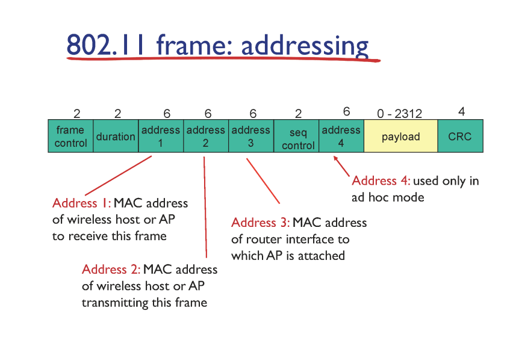
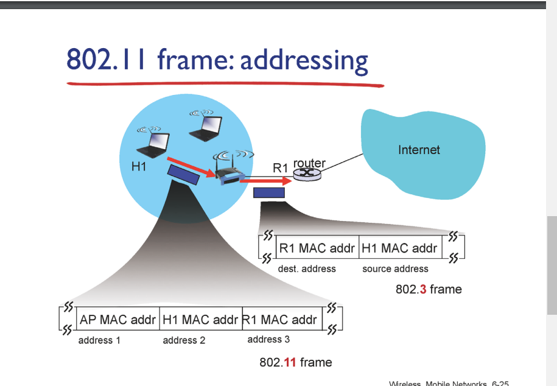

### wifi 프레임

- 어드레스 필드 1 : 이 무선 프레임을 직접적으로 받는 어드레스

- 2 : 이 프레임을 전송하는 인터페이스 어드레스 

- 3 : 이 신호를 처리할 라우터의 mac 어드레스

    

### AP

- 라우터 입장에선 ap 안 보임

- h1에서는 ap가 보임

- 어드레스를 3개 쓴 이유 

- AP는 링크 레이어

- 라우터는 네트워크 레이어

- ap에서는 네트워크 레이어의 역할을 못 해준다

- ap의 mac 어드레스를 아는 법 : ap가 자기 정보를 담은 비콘을 보낸다

- 보통 규모가 큰 곳에서 이런 형식의 공유기 사용

- 가정용은 ap와 라우터가 합쳐진 성능 add2와 3을 처리

    

### mobility

- 이동하는 상황에서 커넥션이 끊기나?

- tcp : 소켓과 소켓 연결

- 스위치에서 스위치 테이블로 기기의 위치를 찾음

- h1이 위치를 이동하므로 스위치 테이블만 바꾸면 끝

- 어떻게 바꿀 것인가

- 

