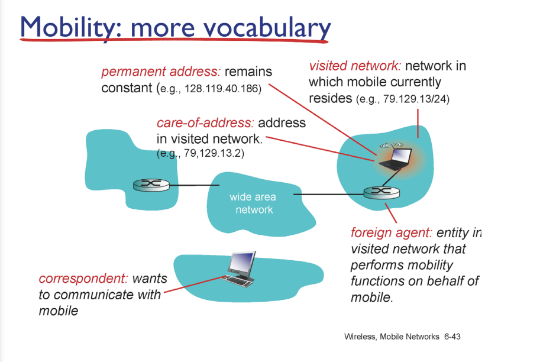

#### wifi

##### advanced capabilities

- 엑세스 포인트에 가까울 수록 성능이 좋다

- 멀리 떨어지면 성능이 구려짐

- SNR (시그널 노이즈 래티오)

- 노이즈 대비 시그널 비율이 높으면 성능이 좋다

- 빠른 대신에 노이즈에 취약, 에러가 높아짐

    

### cellular network

-  전체 지역을 셀이라는 단위로 나눠서 셀에 하나씩 기지국을 세워서 담당한다 

- 셀 안에서 기지국과 기기 간 통신 방법

- 진화단계

- 현재 3g 구조

    

### 모빌리티

- 모바일 환경에서 주소와 라우팅

- 모빌리티 : 이동하면서도 유지 가능하면 높은 것

- 인터넷에 존재하지 않음 > 단지 이상적인 얘기

- 커넥션을 맺고 이동하면 새로운 네트워크에게 포딩 해달라고 요청

