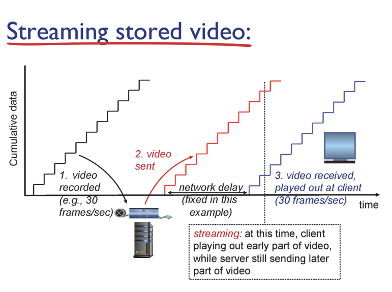
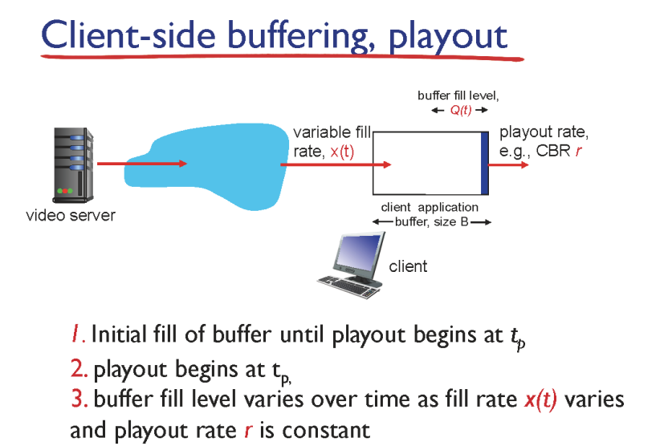

#### 멀티미디어

##### 오디오

- 아날로그 신호

- 디지털 데이터로 전환해야함

- 샘플링해서 전환

- 비트의 수가 클수록 완벽하게 복원

    

##### 비디오

- 비디오는 이미지의 연속

- 코딩 레이트가 높을수록 화질이 좋음

    

### 멀티미디어 네트워킹 3 application

- streaming, stored
  
  - 스트리밍 : 다운로드 하기 전에 바로 플레이
  
  - stored : 서버에 저장된 것 실행

- 데이터가 렌더링되는 것이 느리면 버퍼링 발생

- udp : 클라이언트 신경 안 쓰고 계속 데이터 쏟아부음 > 못 씀

- tcp : 전송속도를 네트워크가 정해서 들쭉날쭉하다 > 쓰기 어려움

- 유튜브는 변형한 tcp 사용

### DASH

- 스트르밍을 동적인 적응형 http를 사용해 보낸다

- 서버 : 비디오 파일을 여러 청크로 나눈다, 청크를 저장하고 다른 속도로 인코딩한다

- 클라이언트 : 처음 청크를 더 빠르게 나머지는 다른속도로

### CDN

- content distribution network

- 컨텐트가 저장된 스토리지 자체를 전세계 곳곳에 분산

- 사용자가 요청하면 유뷰트는 메인페스트 파일만 넘겨주고

- 사용자 근처의 스토리지에서 데이터를 가져옴

- 곳곳의 서버에 영상을 저장

- 호스트에 접근해서 메인페스트 파일 받음 > 호스트의 ip를 알아야함 > ds에 담겨있는데 최종적으로 k cdn에서 알고있다

