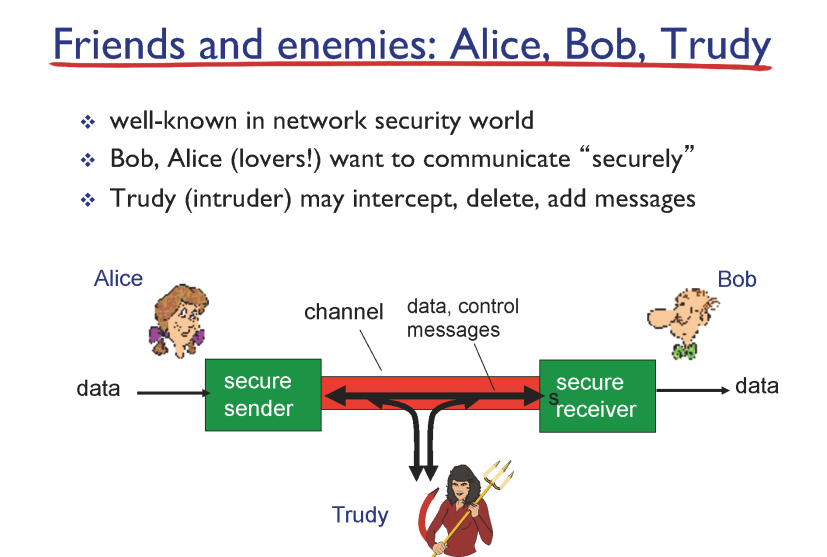
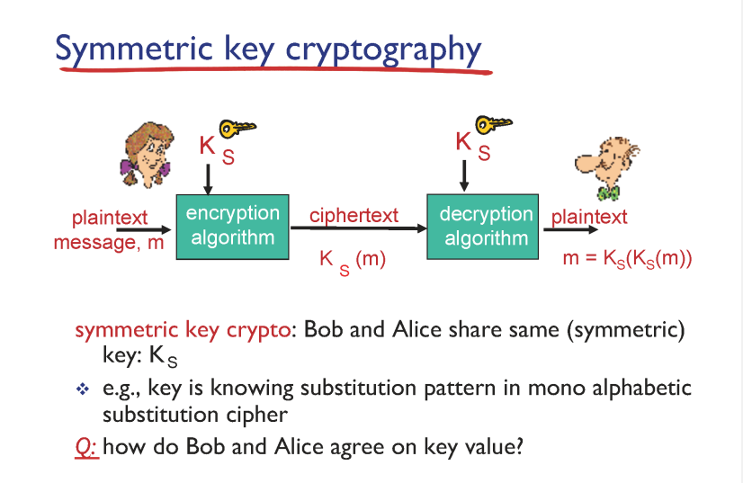
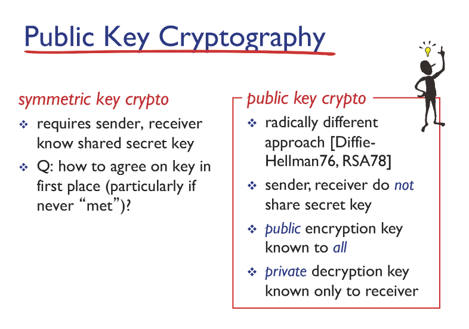
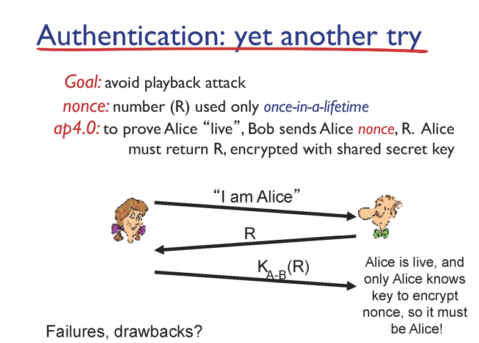
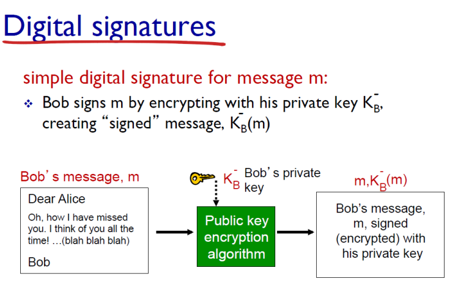
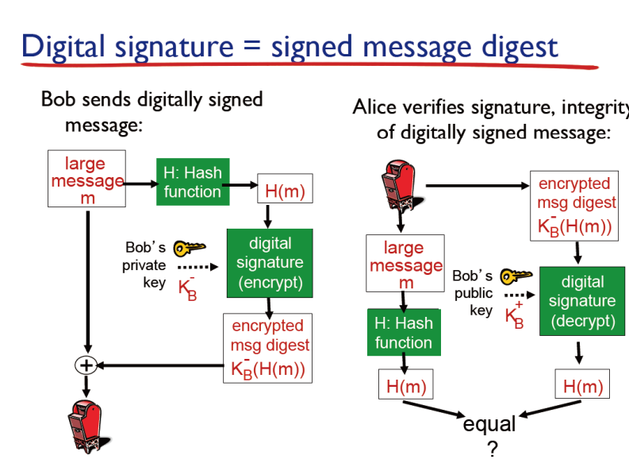

### network security

- confidentiality : 기밀성 : 주고받는 메시지는 둘만 알고 제3자는 몰라야 한다

- authentication : 인증, 내가 메시지를 주고 받는 사람이 다른 사람이 아닌지 확인

- message integrity : 보낸 메세지가 그대로 변하지 않고 받는 사람이 받아야 한다

- acess and availability : 서비스를 제공하는 사람은 24시간 내내 사용자들에게 서비스를 제공해야 한다

    

### ex)

tor : 서버와 클라이언트 바로 연결이 아닌 다른 경로로 우회해서 익명성을 얻는다

- tcp

- http

- 막으려는 사이트와 구글 간 tcp 커넥션 형성

- http 리퀘스트 보내서 사용자가 오면 warning 메세지 보냄

    

### 대칭 키

- 동일한 키를 가지고 있다

- 사전에 키를 공유해야 한다는 번거로움

- 개선

- 모든 사람이 두 개의 키를 가진다(퍼블릭, 프라이빗), 퍼블릭 키로 메세지를 보내고 그 내용은 프라이빗 키를 가지고 있어야지만 볼 수 있다

    

### authentication

- 다른 사람이 재사용할 수 있으면 안 된다

- 메세지 > 랜덤넘버 > 암호화한 랜덤넘버를 답장

    

### 인테그리티

##### digital signatures : 프라이빗 키로 암호화 하는 것

- 변경되지 않았는지

- 프라이빗 키로 인크립션

- 받고나서 퍼블릭키로 해독

- 밥만이 프라이빗키를 가지므로 증명

##### message digests

- 메세지의 해쉬값만 암호화해서 보냄(전체를 하면 오래 걸림)

