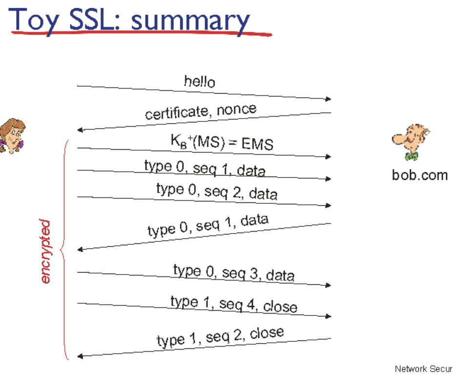

### SSL

- application rayer
  
  - tcp
  
  - ip

TCP를 사용하기 위해서는 http에서 보내주는 request 메세지가 있어야 한다

tcp는 보안을 제공해주지 않는다 > 응급보안 : SSL

- SSL

- TCP

- IP

ssl : 애플리케이션 레이어에 존재하는 라이브러리 ( TLS라고도 부름)

https = http + ssl

    

### handshake

서버를 인증하고 답 보내기

키 하나로 4가지의 키 만들기(각각의 기능을 한다)

    

 

데이터를 hash 펑션에 넣어서 확인한 값

MAC를 통해서 구분

    

### firewall

- 방화벽

- 외부의 패킷을 모니터링하면서 검열

- tcp 헤더까지 봐야한다

- 외부에서 웹 브라우징 막기

    

진화된 방화벽

- tcp가 허용된 리스트에 있는 경우에만 허용

