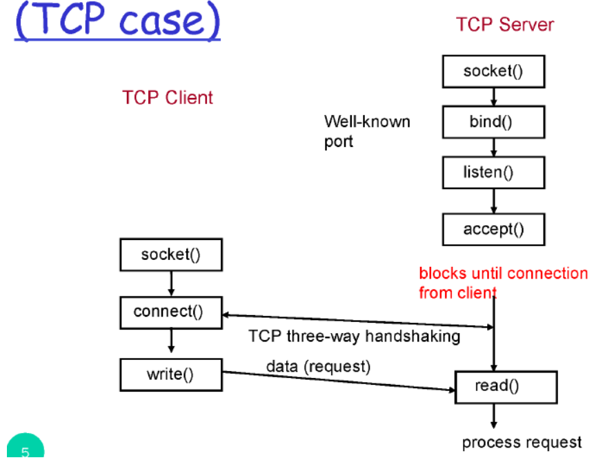
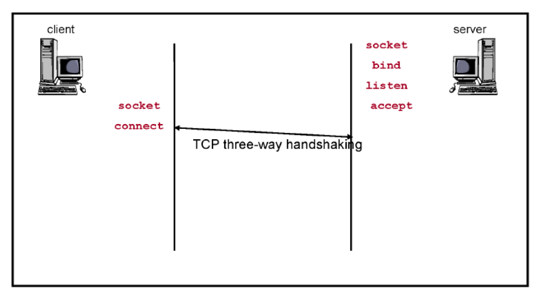
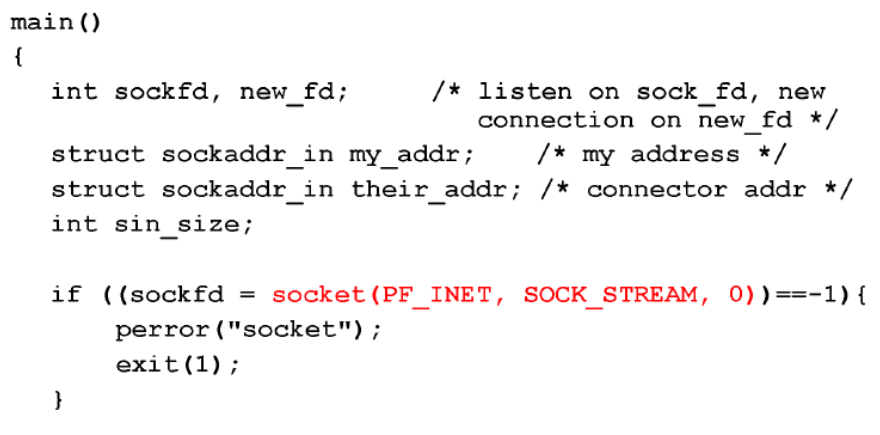
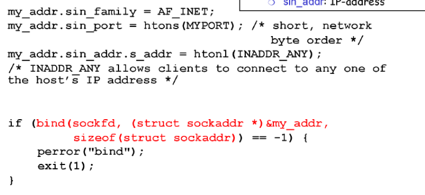
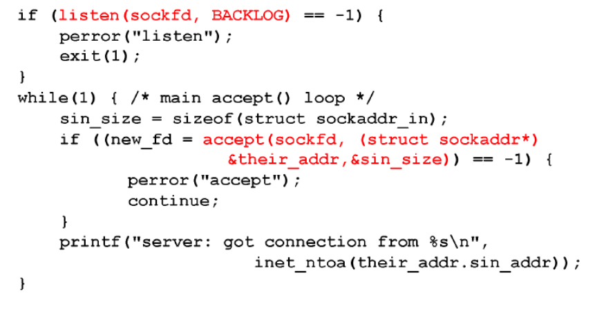
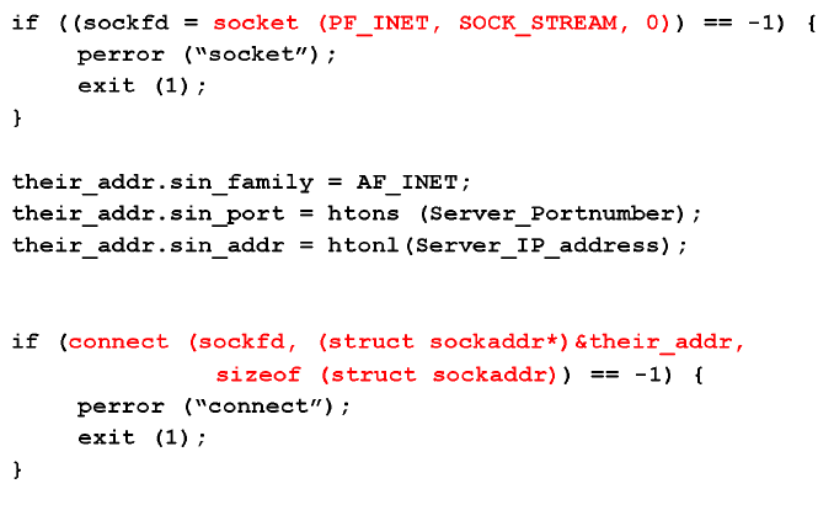
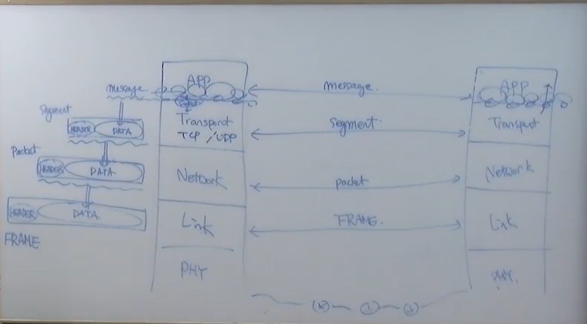
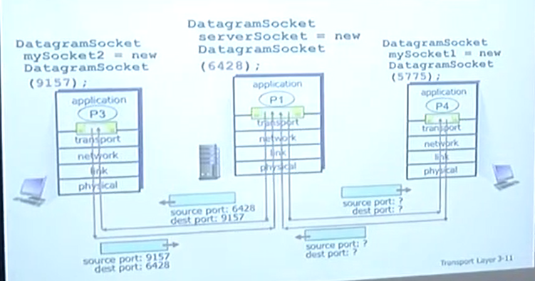
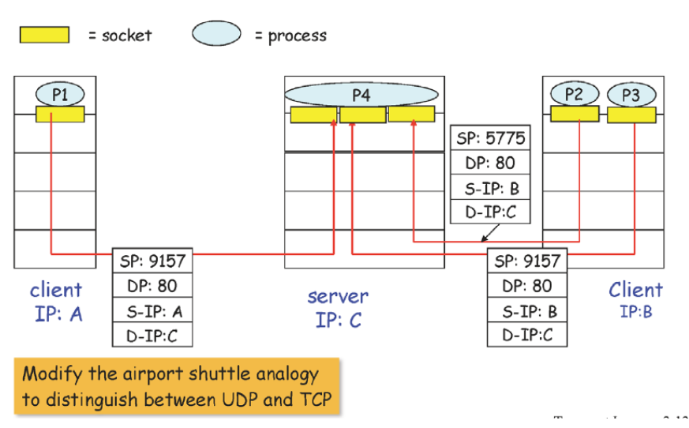
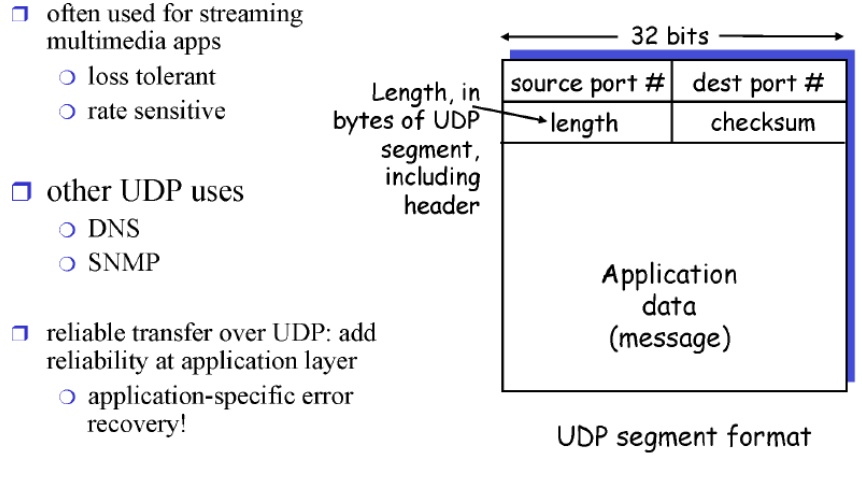

#### 소켓 프로그래밍

### 소켓은 무엇인가

- 소켓은 OS에서 제공해주는 API의 일종

- 트랜스포트 계층에는 tcp와 udp 소켓 뿐이라 앱 계층은 둘 중 하나 선택해야 함

    

### 소켓의 두 종류

- sock_stream
  
  - TCP
  
  - relaiable
  
  - in order

    

- sock_dgram
  
  - udp
  
  - unrelaiable
  
  - no order
  
      
  
  ### API

웹서버 소켓 생성(생성 실패하면 -1 반환)

바인드 : 특정 포트에 바인드

리슨 : 리슨 용도로 쓰겠다

액셉트 : 난 준비가 되었다

서버는 대기

클라이언트

소켓 열기

커넥트 -> 서버에 연결

write : request

서버는 read

write : reply

클라이언트 read

close

서버 read

close

    

#### 소켓 생성

소켓 생성

바인드

액셉트

    

### 소켓

- domain

- type : tcp를 사용할지, udp를 사용할지 정하는 것

- protocol

- 소켓이 성공적으로 생성되면 소켓의 id를 반환

    

### bind

- 소켓의 id를 사용해서 특정 주소에 소켓을 바인드 하겠다

    

### listen

- 방금 생성한 소켓을 리슨 용도로 사용할 것이고 동시에 몇 개의 요청이 들어올 때 까지 처리하겠다

    

### accept

- 클라이언트의 요청에 따른 데이터를 반환할 떄 클라이언트의 주소와 포트를 알게 된다

    

- 클라이언트는 아무 포트나 써도 되기 때문에 바인드를 쓸 필요가 없다

    

- 소켓fd 를 id로 사용

- 리슨과 액셉트

    

### 클라이언트

- 서버의 주소에 접속

    

### project1 web server 구현

- tcp 소켓을 생성해 http request

- tcp 소켓을 생성해 request를 읽고 화면에 띄움

    

### 멀티플렉싱

- 컴퓨터 내부에 많은 프로세스들이 있다

- 애플리케이션에서 트랜스포트로 내려오는 데 세그먼트로 만들어서 내려준다

    

### 디멀티플렉싱

- 트랜스포트에서 메시지를 받아서 알맞은 포트로 하나를 올려주는 것을 말한다

- 세그먼트의 헤더에 적힌 정보를 통해서 알맞은 포트로 올려줌

    

### 세그먼트

- 데이터와 헤더로 구성

- 헤더 내부에 source port 와 dest port가 들어있다 -> 디멀티플렉싱에 사용

- udp의 경우 : dest ip와 dest port만 사용해서 어떤 포트에 넣을지 결정

- 어떤 소켓이라도 상관없이 받음

- TCP의 경우 : source ip와 port / dest ip와 dest port 를 사용해서 결정

- 커넥션을 한 특정 소켓에서만 받음

- d-ip가 같아도, s-ip가 다르면 다 다른 소켓에 넣는다

    

### udp

- 트랜스 포트의 기본적인 기능 제공 (멀티플렉싱, 디멀티플렉싱, 에러체킹)

- header에 어떤 필드가 있는지 아는 것이 중요\

- source port : 16bit, 포트 넘버는 6만대까지

- dest port : 포트 넘버를 통해 멀티플렉싱, 디멀티플렉싱

- length : 길이

- checksum : 전송 중 에러가 있는지 없는지 판단하는 것

    
