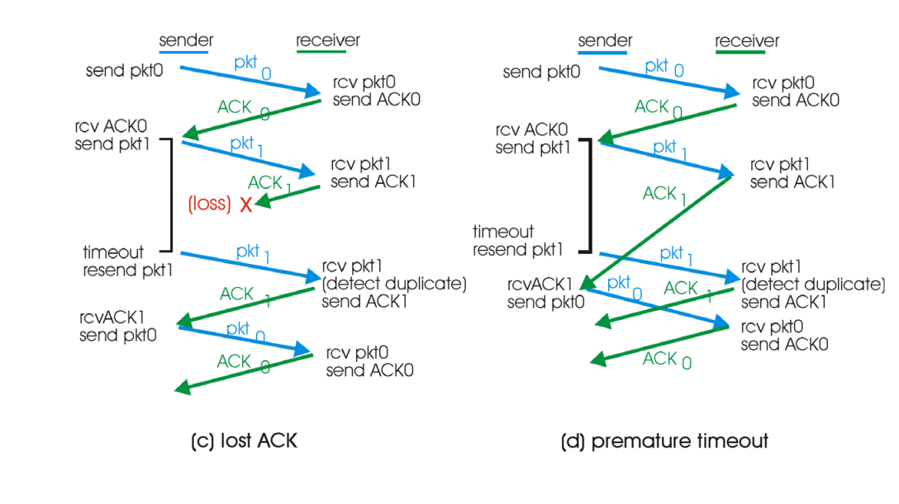

app

transport : TCP/UDP : 멀티플렉싱과 에러체킹 제공 해야 함

network

link

phy

    

#### reliable

데이터가 유실되지 않고 전달되는

RDT : reliable data protocol

#### rdt v 1.0

- 에러 없다

- 유실 없다

- 별도로 손 댈 게 없다

### rdt v 2.0

- error detection (checksum)

- Feedback ( 에러 발생 한 경우 ACK, 발생하징 않은 경우 NCK)

- retransmission

- feedback에 에러가 발생하면 문제가 생긴다

### rdt v2.1

- 패킷 에러를 요약

- 2.0의 문제점 때문에 sequence number를 패킷에 붙여서 보내야 한다

- SN은 header에 들어가는데 헤더는 크기가 작아서 sn이 무한대로 늘어나면 헤더의 크기가 늘어난다. 때문에 sn을 최소화 해야한다

- sn은 2개면 충분하다(ACK와 NCK만 있는 경우)

### rdt v2.2

- nak를 없앤 거

- 받으면 ack 보냄(SN을 담아서, 가장 마지막에 제대로 받은 정보)

- ack의 넘버가 변하지 않으면 nak랑 동일한 효과

    

에러와 메세지 유실이 동시에 일어난경우

데이터가 오고가지 않음, 피드백이 없다

### 3.0

- timer 도입

- 일정 시간 동안 피드백이 없으면 유실로 판단하고 재전송

- timer의 시간은 정답이 없는 문제
  
  시간이 짧으면 리커버리가 빠르다, 중복 발생 가능
  
  시간이 길면 중복 발생 X, 리커버리가 늦다

a : 이상  무

b : 패킷 유실, 타이머 작동, 재 전송

c : ack 유실, 타이머 작동, 재전송

d : 유실 아닌데 시간이 오래 걸림, 타이머 작동, 꼬임

    

packet error > sequence number

packet loss > timer

전부 헤더에 담김

    

차이점

한 번에 하나의 패킷만 보내는 예시들

실제로는 피드백 받지 않고 쏟아붓는다, 그 이후 피드백
