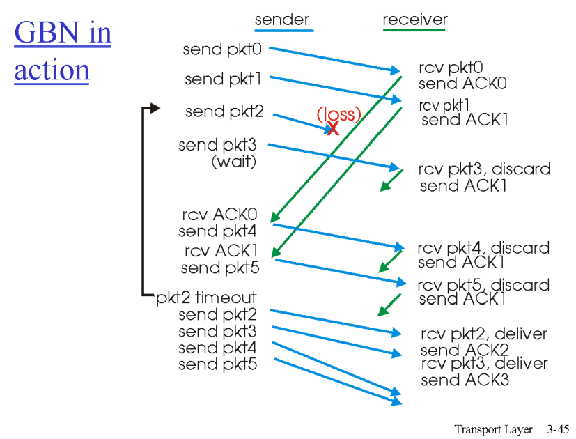
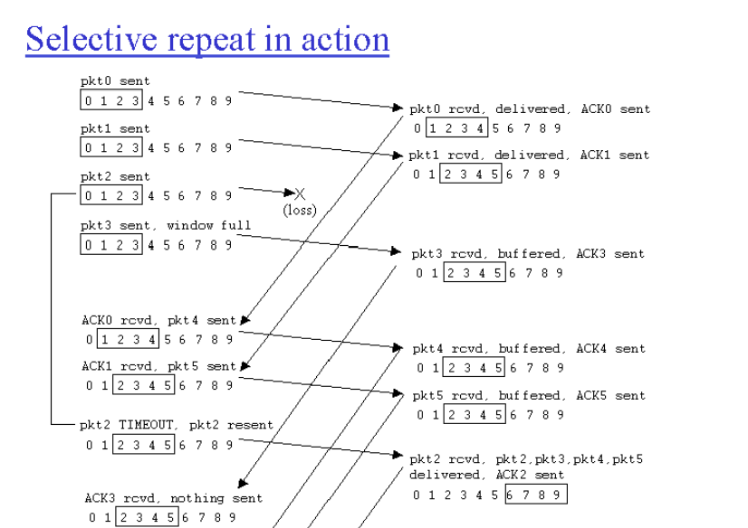
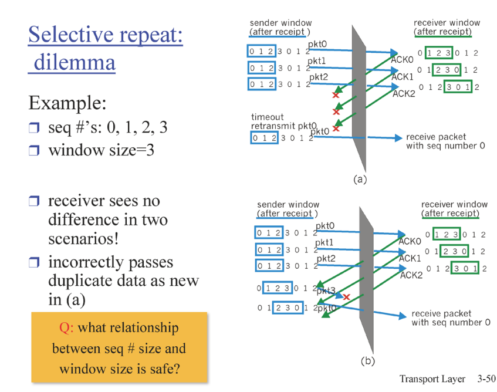

### rdt 3.0

- utilization : 전체 시간 중에러 sender가 사용하는 비율
  
  - 길수록 좋다

- rdt는 신뢰성은 좋지만 효율은 안 좋다, 1개씩 보내니까

- 우리가 지향해야 할 것은 한번에 많이 보내는 것

    

#### pipelined protocols

- 실제로는 데이터를 한번에 대량으로 보내고 데이터에 대한 피드백

### go-back-N

- 많은 패킷을 쏟아 붓는다

- window size 만큼은 피드백 받지 않고 쏟아 부음

- ack11 은 11번까지 잘 봤으니까 12번 내놓으란 의미

- 리시버는 멍청하다

- 시퀀스 넘버만 주구장창 기다린다

- 순서대로만 기다린다 sn1번을 받지 않고 2번을 받으면 유실

- 1번 받고 2번 받고 순서대로 받아야 한다

1번을 받으면 1번은 윈도우 사이즈에서 제거, 다음 번 들어옴

유실이 일어나면 N개 만큼 돌아온다 > 비효율적

    

### selective repeat

- 고백앤에서 개선

- 선택해서 반복

- ack 7은 7번을 잘 받았다는 의미

- 윈도우 사이즈는 유실된 패킷만 재전송

- 유실된 패킷까지 받으면 윈도우를 옮긴다

- 문제점
  
  -  SN이 반복되는 것 012012(최소의 SN의 범위를 위해)
  
  
  
  - SN의 범위를 윈도우 사이즈 만큼만 준비하면 처음 패킷이 유실된 거라도 다음 번 패킷이 들어온 걸로 생각할 수 있다
  
  - SN의 범위를 구분할 수 있는 최소의 범위로 늘리기

