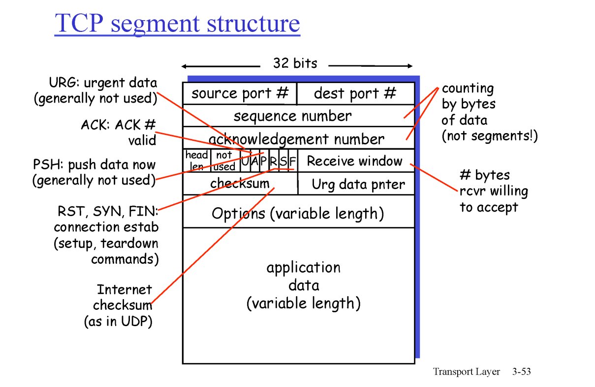
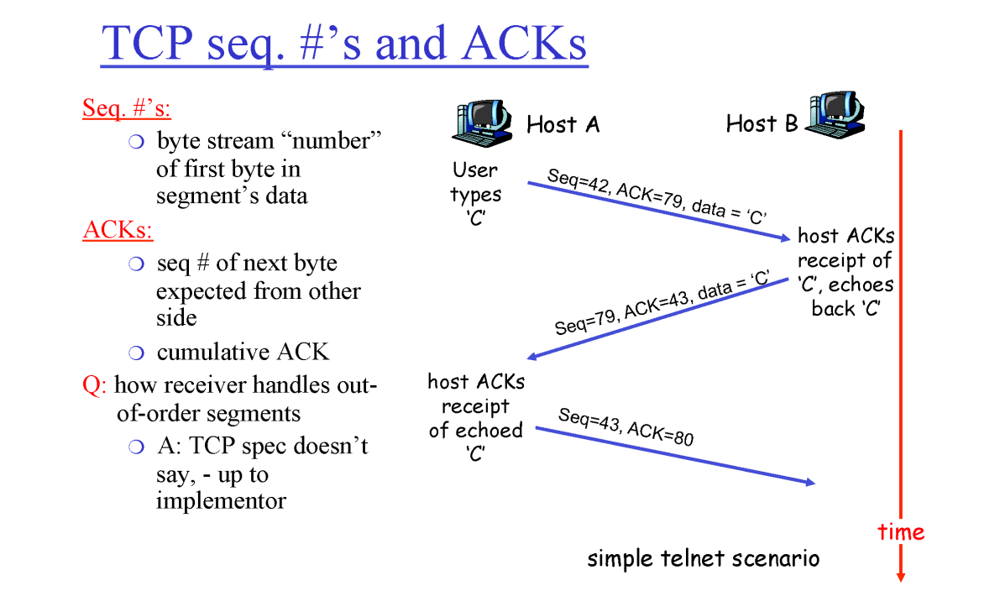
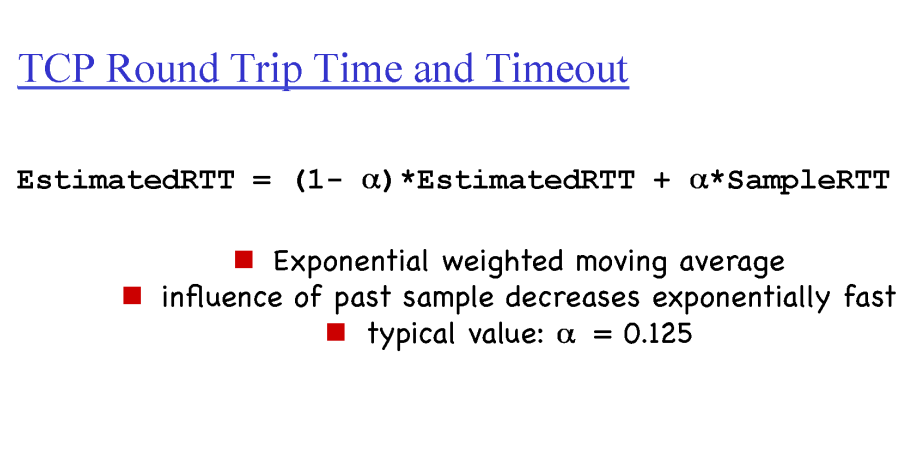
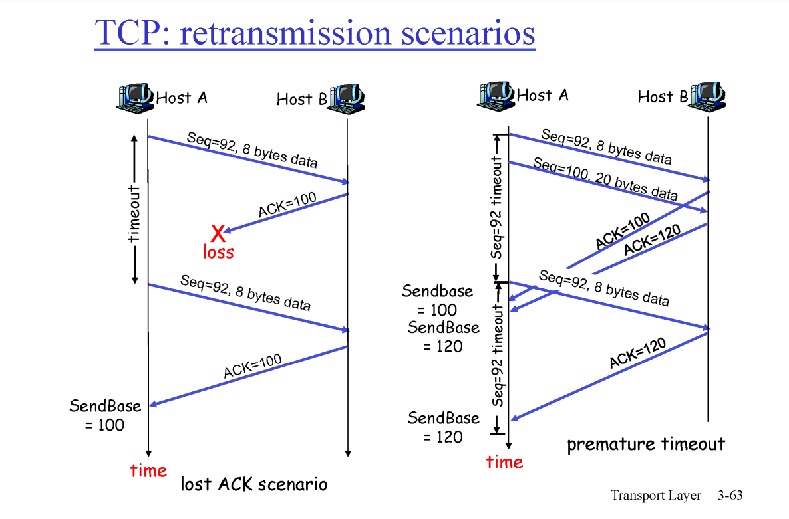
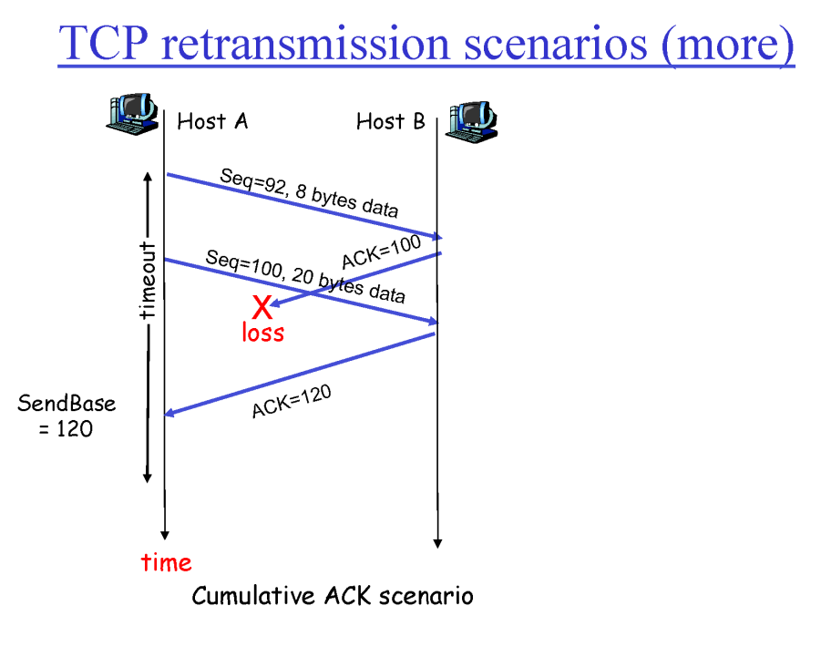

tcp : 

- p to p : noe sender, one receiver

- reliable : 신뢰할 수 있고

- in-order : 순차적으로

- pipelined : 한꺼번에 패킷들을 쏟아붓는다

- 모두가 센더면서 리시버다

- sender window buffer > receiver buffer ( 한 쪽만 보내는 경우)

- 현실은 둘 다 보유 (sender,receiver > receiver, sender)

    

### TCP segment

- app : messeage

- tcp : segement(data|header)

- nw : packet(data|header)

- link : frame(data|header)

- ph

    

- header : port n : 이론 상 6만 번 정도 맥시멈

- sequence n

- ack

- checksum

    

### ack

- C = data(다른 거여도 ㄱㅊ)

- cumulative : 10번이면 9번까지 잘 받았으니 10번을 달라
  
  seq n 1,2,3,4,5를 받았어도 ack1,2,3,4,5가 아닌 5만 보낸다

- seq 42번을 받으면 43번을 요구한다고 ack43을 보내야 함

- seq 42, ack 79 > ack43, seq 79 응답 

    

### timer

- 크면 반응이 느리다

- 작으면 반응이 빠른 대신 부담이 커진다

- RTT (round trip time) 이 주어지면 그걸 기준으로 생각

- 각 세그먼트 별로 다 다르다 (경로 마다, que 상황 마다 다르다)

    

### reliable transfer

- seq 92, byte 8  > ack 100 X : 반복

- 유실 아니지만 오는 동안 타임아웃

- 120번까지 잘 받았단 ack

- 100번까지 유실인데

- ack 100 을 못 받았지만 , 120을 받으면 그 이전까지는 다 클리어

- 장점이다

    

### timer 가 터지기 전에 유실을 알 수 있다?

- 1~100까지 seq, 그러나 10 유실, ack10을 연속하여 반환하면 유실을 알 수 있다. (3번)

- 3dup ack : ack10, ack10, ack10, ack10 : 총 4번째 ack

- fast retransmit

